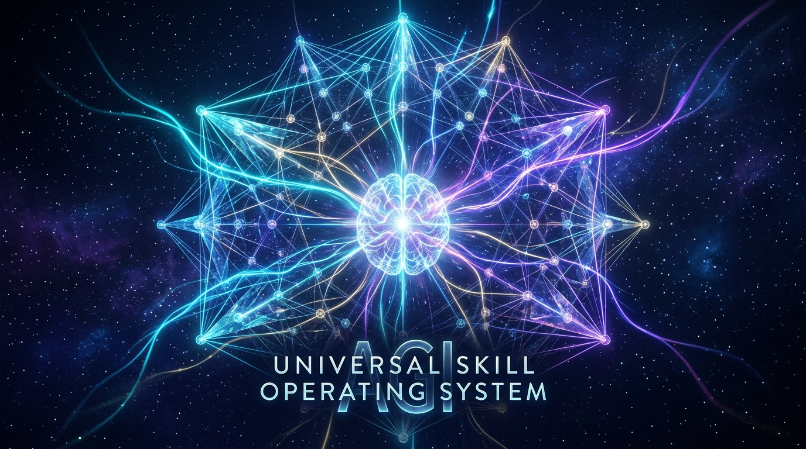

<p align="center">
  
</p>

<div align="center">

# 🌌 ALL SKILLS — UNIVERSAL AGI SKILL OPERATING SYSTEM
### *Autonomous Cognition, Multi-Platform Execution & Capability Orchestration Engine*

<p align="center">
  
  
  
  
  
  
  
  
</p>

<p align="center">
  <strong>The Universal Skill Operating System for Autonomous AI Agents — providing deterministic multi-stage routing, capability-based skill stacks, least-privilege sandboxing, and dynamic integration across Claude Code, Cursor, OpenAI Codex, GitHub Copilot, Gemini CLI, Antigravity, VS Code, Windsurf, OpenCode, Cline, Roo Code, and Block Goose.</strong>
</p>

<p align="center">
  <a href="awesome_skills/CATALOG.md"><strong>Explore Catalog (14,855 Skills)</strong></a> •
  <a href="docs/spec/V2_RUNTIME_MASTER_PLAN.md"><strong>v2 Master Plan</strong></a> •
  <a href="docs/spec/AGENT_RUNTIME_SPECIFICATION.md"><strong>Runtime Spec</strong></a> •
  <a href="#-universal-cli-allskills"><strong>Universal CLI (allskills)</strong></a> •
  <a href="ontology/"><strong>Universal Ontology</strong></a> •
  <a href="adapters/"><strong>Platform Adapters</strong></a> •
  <a href="mcp/"><strong>MCP Architecture</strong></a> •
  <a href="policies/"><strong>Security Policies</strong></a>
</p>

</div>

---

## 🌟 Why All Skills?

When AI coding assistants are front-loaded with thousands of prompt instructions upfront, context windows choke, instruction adherence deteriorates, and token usage explodes.

**All Skills** solves this through a **3-tier hybrid architecture**:

```
┌─────────────────────────────────────────────────────────────────────────────────────────────────┐
│                                   ⚡ ALL SKILLS PLATFORM TIERS                                  │
├───────────────────────────────┬─────────────────────────────────┬───────────────────────────────┤
│    1. ⚡ CANONICAL ENGINE      │      2. 🚀 AWESOME LIBRARY      │    3. 🤖 UNIVERSAL HARNESS    │
│          (skills/)            │        (awesome_skills/)        │     (.agents/ / .claude/ /    │
│                               │                                 │     .cursor/ / .codex/)       │
├───────────────────────────────┼─────────────────────────────────┼───────────────────────────────┤
│  • 122 Curated & Tested Skills│  • 14,855 Categorized Skills     │  • 70 Staff Engineer Skills   │
│  • 9-Signal Layered Scoring   │  • 251 Functional Domain Dirs   │  • Pre-Loaded in Workspace    │
│  • Deterministic Workflows    │  • Machine-Readable Index       │  • Native Multi-Tool Synced   │
│  • 8-State Formal Lifecycle   │  • Complete CATALOG.md Reference│  • $O(1)$ Load-on-Demand      │
│  • 94/94 Passing Unit Tests   │  • Dynamic Manager CLI          │  • Zero Prompt Bloat          │
└───────────────────────────────┴─────────────────────────────────┴───────────────────────────────┘
```

- 🧠 **Context-Efficient ($O(1)$)**: Prompts stay hyper-lean. Your agent activates the exact right instruction block (`SKILL.md`) at the moment it's required.
- 🎯 **9-Signal Layered Router**: Sub-millisecond natural-language routing with deterministic scoring (Exact ID → Alias → Category → Trigger Phrase → Keyword Overlap → Capabilities/IO Vocabulary → Token Overlap → Dependency Availability → Quality Boost).
- ⛓️ **Deterministic Chaining**: Compose complex multi-step workflows like `deep-research`, `anti-procrastination`, and `code-review-flow` with dry-run telemetry.
- 🛡️ **Defensive Security & Quarantine**: AST-free static inspection against prompt injections, credential leaks, and pipe-to-shell payloads with a hardened quarantine boundary (`skills/_quarantine/`).
## 🏛️ Platform Architecture & Routing Pipeline

```
                              ┌────────────────────────┐
                              │      USER REQUEST      │
                              └───────────┬────────────┘
                                          │
                                          ▼
                              ┌────────────────────────┐
                              │     Intent Parser      │
                              └───────────┬────────────┘
                                          ▼
                              ┌────────────────────────┐
                              │  9-Signal Domain Router│
                              └───────────┬────────────┘
                                          ▼
                              ┌────────────────────────┐
                              │    Capability Match    │
                              │ (Inputs/Outputs/Tools) │
                              └───────────┬────────────┘
                                          ▼
                              ┌────────────────────────┐
                              │  Candidate Skill Set   │
                              └───────────┬────────────┘
                                          ▼
                              ┌────────────────────────┐
                              │ Dependency / Conflict  │
                              │       Resolution       │
                              └───────────┬────────────┘
                                          ▼
                              ┌────────────────────────┐
                              │ Security & Permission  │
                              │  Check (AST & Policy)  │
                              └───────────┬────────────┘
                                          ▼
                              ┌────────────────────────┐
                              │    Skill Execution     │
                              │ (Load 1 SKILL.md O(1)) │
                              └───────────┬────────────┘
                                          ▼
                              ┌────────────────────────┐
                              │   Validation / Tests   │
                              │ (Post-Execution Hooks) │
                              └───────────┬────────────┘
                                          ▼
                              ┌────────────────────────┐
                              │      FINAL RESULT      │
                              └────────────────────────┘
```

### 📊 Platform Metrics & Tier Definitions

To ensure transparency across our single-source-of-truth metadata (`stats.json`):
- **Unique Skill Identities**: Distinct, deduplicated capabilities across all categories.
- **Indexed Catalog Records**: Physical skill packages cataloged in `awesome_skills/` and searchable via `awesome_skills/CATALOG.md`.
- **Canonical Routed Skills**: Curated, tested foundational skills residing in `skills/` with formal lifecycle states.
- **Active Harness Skills**: Preloaded skills in `.agents/skills/` available directly to active agents.
- **Manifest Skills**: Formally declared tool and permission contracts indexed in `manifest.json`.
- **Virtual Organization Layer**: The `catalog/` hierarchy maps all skills into 15 high-level super-domains, tasks, maturity tiers, and agent compatibility views without moving or deleting physical files.
- **Repository Architecture Map**: Detailed breakdown of every top-level directory in [`docs/REPOSITORY_MAP.md`](docs/REPOSITORY_MAP.md).


---

## 🤖 Multi-Platform Support: Works Across 11 AI Coding Agents

Every skill in this repository strictly adheres to the open **Agent Skills standard** (`SKILL.md` + YAML frontmatter) with dynamic adapter mappings under [`adapters/`](adapters/):

| AI Coding Agent | Workspace Path | Adapter Config | Verification Status |
| :--- | :--- | :--- | :---: |
| **Claude Code** | `.claude/skills/` | [`adapters/claude.yaml`](adapters/claude.yaml) | ✅ Verified (100%) |
| **Cursor** | `.cursor/skills/` | [`adapters/cursor.yaml`](adapters/cursor.yaml) | ✅ Verified (100%) |
| **Antigravity / Gemini CLI** | `.agents/skills/` | [`adapters/gemini.yaml`](adapters/gemini.yaml) | ✅ Verified (100%) |
| **OpenAI Codex CLI** | `.codex/skills/` | [`adapters/codex.yaml`](adapters/codex.yaml) | ✅ Verified (100%) |
| **GitHub Copilot** | `.github/skills/` | [`adapters/copilot.yaml`](adapters/copilot.yaml) | ✅ Verified (100%) |
| **VS Code Agent** | `.vscode/skills/` | [`adapters/vscode.yaml`](adapters/vscode.yaml) | ✅ Verified (100%) |
| **Codeium Windsurf** | `.windsurf/skills/` | [`adapters/windsurf.yaml`](adapters/windsurf.yaml) | ✅ Verified (100%) |
| **OpenCode** | `.opencode/skills/` | [`adapters/opencode.yaml`](adapters/opencode.yaml) | ✅ Verified (100%) |
| **Cline** | `.cline/skills/` | [`adapters/cline.yaml`](adapters/cline.yaml) | ✅ Verified (100%) |
| **Roo Code** | `.roo/skills/` | [`adapters/roo.yaml`](adapters/roo.yaml) | ✅ Verified (100%) |
| **Block Goose** | `.goose/skills/` | [`adapters/goose.yaml`](adapters/goose.yaml) | ✅ Verified (100%) |

---

## 🚀 Universal CLI (`allskills`)

Manage the entire skill ecosystem, verify harnesses, search capabilities, install role profiles, and run diagnostics directly from your terminal:

```bash
# Run complete system health check & platform harness diagnostics
allskills doctor        # On Windows: .\allskills.bat doctor

# Search across 14,855+ skills using multi-stage keyword & capability matching
allskills search "accessibility audit"
allskills search "kubernetes helm"

# Install and activate curated role profiles
allskills profile install software-engineer
allskills profile install cybersecurity
allskills profile install ai-engineer

# Verify cryptographic lockfile, schemas, and harness symlink integrity
allskills verify

# Run regression test suite (94 tests)
allskills test

# Inspect upstream source registry and trust tiers
allskills sources

# Synchronize skills from authoritative upstream repositories
allskills sync
```

---

## 🧠 Autonomous Agent Infrastructure

Beyond instruction text files, **All Skills** provides a complete execution, validation, and security framework for fully autonomous AI agents:

```
┌───────────────────────────────────────────────────────────────────────────────────────┐
│                        ⚡ AUTONOMOUS AGENT EXECUTION ARCHITECTURE                      │
├────────────────────────────────┬──────────────────────────────────────────────────────┤
│ 1. Structural Standardization  │ • Draft-07 JSON Schema (`schemas/skill-frontmatter`) │
│                                │ • Universal Tool & MCP Manifest (`manifest.json`)    │
│                                │ • Native Model Context Protocol (`mcp_config.json`)  │
├────────────────────────────────┼──────────────────────────────────────────────────────┤
│ 2. State & Lifecycle Hooks     │ • Pre-Execution: Git baseline snapshot, env & perms  │
│                                │ • Post-Execution: AST parse gate, regression tests   │
│                                │ • On-Failure: State fingerprinting & loop breaking   │
├────────────────────────────────┼──────────────────────────────────────────────────────┤
│ 3. Specialized Guardrails      │ • Context Budgeting & Pruning (70% tipping point)    │
│                                │ • AST Code Transformation (zero regex corruption)    │
│                                │ • Security Directives (forbidden files & commands)   │
└────────────────────────────────┴──────────────────────────────────────────────────────┘
```

### 📋 Key Infrastructure Components:
1. **Formal Frontmatter Schema**: [`schemas/skill-frontmatter.schema.json`](schemas/skill-frontmatter.schema.json) validates required properties (`name`, `description`, `category`, `disable-model-invocation`), triggers, aliases, and tool permissions via `python scripts/validate_schema.py`.
2. **Master Intent Router (`which-skill`)**: [`.agents/skills/which-skill/SKILL.md`](.agents/skills/which-skill/SKILL.md) provides instant decision matrix mapping and CLI routing (`python scripts/skills/skills.py route`) across all 14,855+ skills.
3. **Multi-Step Execution Playbooks (`workflows/`)**: Complete chained workflows in [`workflows/`](workflows/) (`feature-development.md`, `bug-investigation-and-fix.md`, `fullstack-saas-launch.md`, etc.) for autonomous multi-step execution.
4. **State Tracking & Stack Manifests (`aas-stack.json`)**: Structured sidecar schema ([`schemas/aas-stack.schema.json`](schemas/aas-stack.schema.json)) and CLI ([`scripts/manage_state.py`](scripts/manage_state.py)) for tracking phase progress, variables, and architectural decisions (ADRs) with auto-synced [`CONTEXT.md`](CONTEXT.md).
5. **Central Tool-to-Skill Manifest**: [`manifest.json`](manifest.json) indexes all 192+ platform skills, mapping them to required tool permissions (`bash`, `file_edit`, `ast_grep`, `browser`), MCP servers (`filesystem`, `git`, `fetch`, `memory`), and lifecycle hooks.
6. **Model Context Protocol (MCP)**: Native [`mcp_config.json`](mcp_config.json) configuring local MCP servers for Claude Code, Cursor, and Antigravity.
7. **Lifecycle Hooks Engine**: Execute automated gates before and after skills run via [`scripts/run_hook.py`](scripts/run_hook.py):
   ```bash
   # Pre-execution: check env, snapshot Git baseline, verify tool permissions
   python scripts/run_hook.py pre active.context-budget-and-pruning

   # Post-execution: verify AST syntax on modified files and run test suite
   python scripts/run_hook.py post active.context-budget-and-pruning

   # Inspect all configured hooks
   python scripts/run_hook.py list
   ```
8. **Automated Setup Scripts (`/setup-skills`)**: One-command initialization for any environment:
   - Linux / macOS: `./setup.sh`
   - Windows: `.\setup.bat`
   - Universal Python CLI: `python scripts/setup_skills.py`
9. **Deterministic Fallback & Loop Prevention**: [`docs/spec/FALLBACK_AND_RECOVERY.md`](docs/spec/FALLBACK_AND_RECOVERY.md) specifies the 4-tier recovery tree with SHA-256 error fingerprinting to immediately break infinite retry loops.
10. **Universal Native Directives**: Pre-configured root instruction files that agents automatically ingest:
    - [`AGENTS.md`](AGENTS.md) — For Antigravity, OpenAI Codex, and multi-agent harnesses
    - [`CLAUDE.md`](CLAUDE.md) — For Anthropic Claude Code
    - [`.cursorrules`](.cursorrules) — For Cursor IDE
    - [`rules/`](rules/) — Modular rules for context pruning, AST edits, and security guardrails

---

## 🚀 Pre-Loaded Active Harness Skills (70 Skills)

Your workspace comes pre-loaded with **70 staff-engineer and AI architect playbooks** in [`.agents/skills/`](.agents/skills/) (synced to `.claude/skills/`, `.cursor/skills/`, and `.codex/skills/`):

<details open>
<summary><strong>📋 View Pre-Loaded Skill Suites</strong></summary>

### 1. 🎯 Core Planning & Workflow Architecture
- `which-skill` — Master agent intent router across all 14,855+ skills and workflows
- `brainstorming` — Socratic design refinement before implementation
- `context-budget-and-pruning` — Token budget management, scratchpad offloading, and state distillation
- `executing-plans` — Batch plan execution with verification checkpoints
- `concise-planning` — Actionable, atomic checklists (2–5 minute tasks)
- `subagent-driven-development` — Autonomous recursive child-agent delegation
- `dispatching-parallel-agents` — Concurrently tackle independent files/modules
- `using-git-worktrees` — Isolated Git working trees for clean parallel branches
- `verification-before-completion` — Mandatory automated test & build checks
- `llm-prompt-optimizer` — Precision prompt engineering using the RSCIT framework

### 2. 🧪 Code Quality, Testing & Debugging
- `ast-code-transformation` — Structural AST pattern matching, tree-sitter safety, and syntax gates
- `code-showcase-systematic-debugging` — 4-phase root-cause analysis (Isolate, Trace, Hypothesize, Fix)
- `tdd` — Strict Red-Green-Refactor test-driven cycles
- `code-reviewer` — Automated quality sweep against tech debt and N+1 queries
- `code-review-excellence` — Collaborative, senior review workflows
- `review-and-simplify-changes` — Diff optimization and simplification
- `requesting-code-review` — Structured pre-review self-audits and patch summaries
- `receiving-code-review` — Systematic response to human critique and CI logs
- `performance-profiling` — CPU, memory, and bundle bottleneck optimization

### 3. 🌐 Full-Stack Web & Frontend Engineering
- `design-system` — Token architecture, typography hierarchy, and UI invariants
- `tailwind-design-system` — Production-grade Tailwind CSS tokens and variants
- `wcag-audit-patterns` — Comprehensive WCAG 2.2 accessibility remediation
- `accessibility-compliance-accessibility-audit` — Screen-reader and ARIA auditing
- `playwright-skill` — End-to-end browser automation and test execution
- `browser-automation` — Robust DOM interactions and visual verifications
- `browser-act` — Authenticated browser workflows and extraction
- `react-state-management` — Predictable state layers (Zustand, RTK, TanStack Query)
- `angular-state-management` — Modern Angular signals and component stores

### 4. 🗄️ Backend, APIs & Database Engineering
- `api-designer` — Clean, production-ready REST & GraphQL schemas
- `api-and-interface-design` — Stable public contracts and module boundaries
- `api-documentation` — OpenAPI/Swagger specs and developer guides
- `database-design` — Normalized SQL schemas, indexing, and partitioning
- `prisma-expert` — Type-safe relational modeling and query optimization
- `drizzle-orm-expert` — Serverless SQL query builders and migrations
- `redis-cli` — Cache-aside strategies, invalidation, and TTL tuning
- `database-migration` — Zero-downtime forward and backward migration scripts

### 5. 🤖 AI, Agents & Model Context Protocol (MCP)
- `mcp-builder` — FastMCP Python & TypeScript server development
- `mcp-tool-developer` — Production MCP tools with strict JSON schemas
- `ai-engineer` — Advanced RAG, hybrid search, and multi-modal AI systems
- `ai-engineering-toolkit` — Prompt evaluation, context budget planning, and evals
- `agent-memory` — Persistent hybrid memory and vector knowledge stores
- `agent-memory-systems` — Cognitive memory architecture (short-term & long-term)
- `agent-evaluation` — Versioned test harnesses and LLM-as-a-judge scoring
- `context-window-management` — Sliding-window context pruning and memory guards
- `multi-agent-architect` — Production LangGraph, swarm, and supervisor graphs
- `multi-agent-patterns` — Agent handoffs, supervisor loops, and isolation
- `multi-agent-brainstorming` — Multi-agent peer review to stress-test designs
- `agent-tool-builder` — Schema design, error handling, and token optimization

### 6. ☁️ DevOps, Cloud & Infrastructure
- `cloud-devops` — AWS, GCP, Azure, Docker, and Kubernetes deployment
- `terraform-infrastructure` — Modular, state-safe Infrastructure as Code
- `ci-cd-and-automation` — GitHub Actions test matrices, linting, and releases
- `kubernetes-architect` — Cloud-native container orchestration & ArgoCD GitOps
- `kubernetes-deployment` — Production Helm charts, pods, and ingress rules
- `aws-serverless` — AWS Lambda, API Gateway, DynamoDB, and SAM/CDK

### 7. 🛡️ Security, SAST & Vulnerability Auditing
- `security-sandboxing-guardrails` — Ironclad forbidden file blocklists and dangerous shell guardrails
- `top-web-vulnerabilities` — OWASP Top 10 mitigation and security review
- `sast-configuration` — Static Application Security Testing rules and scans
- `security-scanning-security-sast` — Code vulnerability analysis across languages
- `vulnerability-scanner` — Supply chain security and dependency audit
- `marketplace-rbac-audit` — Multi-role marketplace authorization and RBAC
- `secrets-management` — Vault, AWS Secrets Manager, and credential masking
- `red-team-tactics` — Adversarial simulation based on MITRE ATT&CK

### 8. 📈 SaaS Growth, Product & Docs
- `saas-mvp-launcher` — Onboarding, billing (Stripe), and MVP launch roadmap
- `micro-saas-launcher` — Fast indie-hacker MVP execution
- `seo-geo` — Generative Engine Optimization for AI search engines
- `copywriting` — Rigorous, high-converting direct-response copy
- `email-sequence` — Automated customer lifecycle and nurture flows
- `analytics-product` — PostHog, Mixpanel, and telemetry tracking schemas
- `changelog-automation` — Keep a Changelog semantic release notes
- `pdf-official` — PDF text parsing, OCR, and table extraction

</details>

---

## 🛠️ CLI Toolkit & Workflows

The repository includes two powerful CLI suites running on pure standard library with **zero external dependencies**:

### 1. Awesome Skills Manager (`scripts/manage_awesome_skills.py`)
Interact with all 14,855+ categorized skills in [`awesome_skills/`](awesome_skills/):

```bash
# List all 251 domain categories with skill counts
python scripts/manage_awesome_skills.py list

# List all skills inside a specific category
python scripts/manage_awesome_skills.py list --category ai-agents
python scripts/manage_awesome_skills.py list --category security

# Fuzzy search across all 14,855+ skills by keyword
python scripts/manage_awesome_skills.py search "rag"
python scripts/manage_awesome_skills.py search "prompt"
python scripts/manage_awesome_skills.py search "kubernetes"

# View skill details, path, risk level, and instructions preview
python scripts/manage_awesome_skills.py info multi-agent-architect

# Inspect active harness status across all tools
python scripts/manage_awesome_skills.py status

# Install an individual skill into your active agent harness
python scripts/manage_awesome_skills.py install redis-cli

# Install an entire category into your active harness
python scripts/manage_awesome_skills.py install security

# Install role-specific curated bundles
python scripts/manage_awesome_skills.py install-bundle senior-engineer
python scripts/manage_awesome_skills.py install-bundle agentic-architect
python scripts/manage_awesome_skills.py install-bundle fullstack
python scripts/manage_awesome_skills.py install-bundle devops-cloud
python scripts/manage_awesome_skills.py install-bundle security
python scripts/manage_awesome_skills.py install-bundle saas-growth
```

---

### 2. Canonical Routing Engine (`scripts/skills/skills.py`)
Run sub-millisecond natural language routing, quality audits, and workflow chains across the 122 canonical engine skills:

```bash
# Route a natural language goal to the optimal skill
python scripts/skills/skills.py route "I am procrastinating on my project"
python scripts/skills/skills.py route "Review this Python code for security issues"

# Route with chained follow-on suggestions and dry-run preview
python scripts/skills/skills.py route --chain --dry-run "Break my project into tasks"

# Explain routing scores with a per-signal score breakdown
python scripts/skills/skills.py explain "Review this code for vulnerabilities"

# Execute or dry-run named deterministic workflow chains
python scripts/skills/skills.py chain deep-research --dry-run
python scripts/skills/skills.py chain anti-procrastination --dry-run
python scripts/skills/skills.py chain code-review-flow --dry-run

# Run full health diagnostics and 94-test verification suite
python scripts/skills/skills.py doctor
python scripts/skills/skills.py test

# Machine-Readable Dependency & Conflict Graphs
python scripts/skills/skills.py graph react
python scripts/skills/skills.py deps nextjs --recursive
python scripts/skills/skills.py dependents typescript
python scripts/skills/skills.py conflicts react

# Reproducible Lockfile & Cryptographic Verification
python scripts/skills/skills.py lock
python scripts/skills/skills.py verify react-state-management
python scripts/skills/skills.py stale --threshold 90

# Capability-Based Security Policy Enforcement
python scripts/skills/skills.py policy check direct-production-deployment
python scripts/skills/skills.py policy list

# Intent Routing Benchmark & Latency Percentiles
python scripts/skills/skills.py benchmark
```

---

### 3. Interactive Web Marketplace (`marketplace/index.html`)

Launch the glassmorphic discovery dashboard with real-time fuzzy search, capability filters, dependency trees, and instant CLI command copying:

```bash
# Rebuild marketplace database
python scripts/build_marketplace.py

# Launch static discovery server
python -m http.server 3000 --directory marketplace
# Open http://localhost:3000 in your browser
```

---

## 🗂️ Repository Directory Structure

```
All skills/
├── .agents/skills/              # 🤖 Antigravity / Gemini CLI Active Harness (70 skills)
├── .claude/skills/              # 🤖 Claude Code Active Harness (synced via junction)
├── .cursor/skills/              # 🤖 Cursor Active Harness (synced via junction)
├── .codex/skills/               # 🤖 Codex CLI Active Harness (synced via junction)
│
├── awesome_skills/              # 🚀 2,041+ Categorized Skills Library
│   ├── CATALOG.md               # Complete searchable markdown catalog
│   ├── skills_index.json        # 14,855-item metadata database
│   ├── development/             # 187 skills (Coding, Git, Refactoring)
│   ├── cloud/                   # 146 skills (AWS, GCP, Azure, Terraform)
│   ├── ai-ml/                   # 129 skills (Prompting, RAG, Evals)
│   ├── security/                # 82 skills  (SAST, Secrets, RBAC)
│   ├── web-development/         # 65 skills  (Frontend, Fullstack)
│   └── ...                      # 95 additional domain categories
│
├── skills/                      # ⚡ 122 Canonical Engine Skills (8 Categories)
│   ├── productivity/            # Focus, anti-procrastination, planning
│   ├── development/             # TDD, debugging, code-review
│   ├── research/                # Deep research, synthesis
│   ├── web/                     # Browser automation, SEO
│   ├── documents/               # PDF, DOCX, XLSX
│   ├── design/                  # UI/UX, presentations
│   ├── security/                # Static scanning, secrets
│   ├── utilities/               # File and system tools
│   ├── _quarantine/             # Hardened quarantine boundary
│   ├── registry.json            # 6-axis quality scores & lifecycle states
│   └── chains.json              # Named deterministic multi-skill workflows
│
├── scripts/                     # 🛠️ Platform & Harness Tooling
│   ├── setup_tools.py           # Universal multi-tool harness synchronizer
│   ├── manage_awesome_skills.py # Awesome skills search, inspection & installer
│   ├── refresh_registry.py      # Backfill registry metadata & quality scores
│   └── skills/skills.py         # 9-signal router & CLI engine
│
├── docs/skills/                 # 📚 Architecture, Security & Category Documentation
│   ├── ARCHITECTURE.md          # Scoring algorithm & load-on-demand platform
│   ├── SECURITY.md              # Threat model & static inspection policy
│   └── *.md                     # Per-category detailed reference guides
│
└── tests/skill_tests/           # 🧪 Unit & Integration Test Suite (94 tests)
```

---

## 🛡️ Defensive Security & Provenance

- **100% Static Inspection**: The built-in security scanner (`src/skills/security.py`) never executes external scripts. Code is analyzed strictly through AST-free static token matching.
- **Hardened Quarantine**: Any unverified or potentially destructive pattern triggers an immediate hold in `skills/_quarantine/`, completely unrouteable by agents.
- **Audited Provenance**: Upstream adaptations are pinned to explicit Git commit SHAs with author attribution in [`skills/SOURCES.json`](skills/SOURCES.json).

---

## 🧪 Verification & Health Check

Run complete test suites and diagnostic checks at any time:

```bash
# 1. Check health of all 122 canonical skills
python scripts/skills/skills.py doctor

# 2. Run the 94 unit and integration tests
python scripts/skills/skills.py test

# 3. Verify multi-tool harness connections
python scripts/setup_tools.py --status
```

---

## 🏛️ All-skills v2 Operating System Architecture & Master Plan

For the full formal blueprint, see the comprehensive [**All-skills v2 Runtime Master Plan**](docs/spec/V2_RUNTIME_MASTER_PLAN.md) and [**Agent Runtime Specification**](docs/spec/AGENT_RUNTIME_SPECIFICATION.md).

All-skills v2 synthesizes the ecosystem from a raw collection of `SKILL.md` instructions into a **verifiable, sandboxed, composable Agent Operating System** governed by **6 Core Operating Primitives**:

```
                    ALL SKILLS v2 ARCHITECTURE
                                │
        ┌───────────────────────┼───────────────────────┐
        ▼                       ▼                       ▼
     Registry                Router                  Runtime
   [Provenance]           [Multi-Signal]          [Sandboxing]
   [Versioning]           [Large-Scale]           [L0–L4 Autonomy]
   [Lockfiles]            [Telemetry]             [Least-Privilege]
        │                       │                       │
        └───────────────────────┼───────────────────────┘
                                │
                                ▼
                             Composer
                        [Typed I/O Stages]
                        [Sequential/Parallel]
                                │
                                ▼
                            Evaluation
                    [Evidence & Benchmark Suite]
                    [NVIDIA SkillEvaluator / A/B]
```

### 🔒 5-Tier Autonomy Classification (L0 to L4)
Every skill declares an explicit autonomy ceiling governing execution safety and confirmation gates:
- **`L0 — Informational`**: Advisory only. Zero tool mutations (`AUTO`).
- **`L1 — Read-Only`**: Inspect files, search codebase, read logs, run AST linters (`AUTO`).
- **`L2 — Local Modification`**: Workspace file edits, local unit test runs, safe refactoring (`AUTO`).
- **`L3 — External Side Effects`**: Git push, package installation, remote API calls (`ASK - Requires Approval`).
- **`L4 — Production-Impacting`**: Cloud deployments, DB drops, credential changes (`BLOCK / Strict Gate`).

### 📚 Top 10 Reference Repositories Synthesized
All-skills v2 actively builds upon architectural patterns established by the premier agent skill repositories:
1. **`NVIDIA/SkillEvaluator`** — 3-tier validation (Validation $\rightarrow$ Deduplication $\rightarrow$ Live Agent Eval) & benchmarks.
2. **`zhengyanzhao1997/SkillRouter`** — Dual-stage neural reranking and large-scale skill retrieval over 80k+ skills.
3. **`oneal2000/SR-Agents` (SRA-Bench)** — Comprehensive retrieval and joint task execution benchmark.
4. **`SkillLens-AI/skilllens`** — Rigorous separation of utility probes and adversarial security evaluation.
5. **`Aakash2512git/skillregistry`** — Automated skill scanning, semantic indexing, and Recall@K / MRR metrics.
6. **`nikships/skills-registry`** — Distribution engine, Go CLI/TUI, and multi-agent directory packaging.
7. **`anthropics/skills`** — Canonical `SKILL.md` specification and progressive disclosure design.
8. **`darkrishabh/agent-skills-eval`** — Empirical A/B evaluation measuring delta performance with-vs-without skills.
9. **`simota/agent-skills`** — Nexus multi-agent orchestrator, agent personas, and cross-agent recipes.
10. **`open-agent-craft/awesome-agent-skills`** — Broad domain categorization index and community skill curation ecosystem.

---

## 📄 License

Individual skills retain their respective open-source licenses (MIT, Apache-2.0, or Custom). Provenance details are documented in [`skills/SOURCES.json`](skills/SOURCES.json) and [`awesome_skills/skills_index.json`](awesome_skills/skills_index.json).