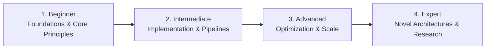

# 📂 Artificial Intelligence & Machine Learning

> **Category Directory**: `categories/01-artificial-intelligence-and-machine-learning/`  
> **Status**: Comprehensive Universal Reference & Taxonomy Layer  
> **Mastery Progression**: Beginner → Intermediate → Advanced → Expert  

---

## Overview

Comprehensive AI/ML systems: Deep Learning, Classical ML, NLP, Computer Vision, Reinforcement Learning, MLOps, Generative AI, and Specialized AI disciplines.

---

## 📑 Core Taxonomy & Skill Hierarchy

### 🔹 Deep Learning
- **CNN (Convolutional Neural Networks)**
- **RNN (Recurrent Neural Networks)**
- **LSTM (Long Short-Term Memory)**
- **GAN (Generative Adversarial Networks)**
- **Transformers (BERT, GPT architecture, Attention Mechanisms)**
- **Autoencoders (VAE, Denoising Autoencoders)**
- **Diffusion Models (DDPM, Score-Based Generative Models)**
- **Neural Architecture Search (NAS)**
- **Capsule Networks**

### 🔹 Classical Machine Learning
- **Linear & Logistic Regression**
- **Decision Trees & Random Forests**
- **Support Vector Machines (SVM)**
- **K-Nearest Neighbors (KNN)**
- **Naive Bayes Classifiers**
- **Gradient Boosting (XGBoost, LightGBM, CatBoost)**
- **Clustering Algorithms (K-Means, DBSCAN, Hierarchical)**
- **Dimensionality Reduction (PCA, t-SNE, UMAP)**
- **Ensemble Methods & Stacking**

### 🔹 Natural Language Processing (NLP)
- **Tokenization, Stemming & Lemmatization (BPE, WordPiece)**
- **Named Entity Recognition (NER)**
- **Sentiment Analysis & Opinion Mining**
- **Machine Translation (Seq2Seq, Transformer)**
- **Text Summarization (Extractive & Abstractive)**
- **Question Answering & SQuAD Systems**
- **Topic Modeling (LDA, BERTopic)**
- **Word Embeddings (Word2Vec, GloVe, FastText)**
- **Speech-to-Text & Text-to-Speech (Whisper, Tacotron)**
- **Conversational AI & Chatbot Development**

### 🔹 Computer Vision
- **Image Classification (ResNet, ViT)**
- **Object Detection (YOLOv8/v10, SSD, Faster R-CNN)**
- **Image Segmentation (Semantic, Instance, Panoptic)**
- **Face Recognition & Biometric Detection**
- **Pose Estimation (OpenPose, MediaPipe)**
- **Optical Character Recognition (OCR - Tesseract, TrOCR)**
- **Video Analysis & Action Recognition**
- **Generative Vision (ControlNet, LoRA, SDXL)**
- **3D Vision, NeRFs & Point Clouds**
- **Medical Imaging Diagnostics (DICOM processing)**

### 🔹 Reinforcement Learning
- **Q-Learning & Tabular Methods**
- **Deep Q-Networks (DQN, Double DQN, Dueling DQN)**
- **Policy Gradient Methods (REINFORCE)**
- **Actor-Critic Architectures (A2C, A3C, PPO, SAC)**
- **Multi-Agent Reinforcement Learning (MARL)**
- **Inverse Reinforcement Learning (IRL)**
- **Model-Based RL (MuZero, Dreamer)**

### 🔹 MLOps & AI Infrastructure
- **Model Versioning & Artifact Registries (MLflow, DVC)**
- **Feature Stores (Feast, Hopsworks)**
- **Model Serving (Triton, TorchServe, vLLM, TGI)**
- **Experiment Tracking (Weights & Biases, Neptune, Comet)**
- **Data & ML Pipelines (Apache Airflow, Kubeflow, Prefect)**
- **Model Monitoring & Data Drift Detection (Evidently AI)**
- **A/B Testing & Shadow Deployment for Models**
- **AutoML Pipelines (Auto-sklearn, H2O, FLAML)**

### 🔹 Generative AI & LLMs
- **Large Language Model Fine-Tuning (SFT, LoRA, QLoRA, DPO, RLHF)**
- **Prompt Engineering (Chain-of-Thought, ReAct, Tree-of-Thought)**
- **Retrieval Augmented Generation (RAG, Hybrid Search, Dense Rerankers)**
- **Agent Orchestration Frameworks (LangChain, LlamaIndex, AutoGPT, CrewAI)**
- **Vector Databases (Pinecone, Qdrant, Weaviate, Milvus, ChromaDB)**
- **Multimodal AI Systems (GPT-4V, Gemini, CLIP)**
- **Image Generation (Stable Diffusion, Midjourney workflows)**
- **Voice Cloning & Audio Generation (ElevenLabs, Coqui)**

### 🔹 Specialized AI Disciplines
- **Recommendation Systems (Collaborative Filtering, Two-Tower)**
- **Anomaly Detection in High-Dimensional Data**
- **Time Series Forecasting (Prophet, N-BEATS, PatchTST)**
- **Graph Neural Networks (GCN, GAT, PyTorch Geometric)**
- **Federated Learning & Privacy-Preserving AI**
- **Few-Shot, Zero-Shot & In-Context Learning**
- **Explainable AI (SHAP, LIME, Integrated Gradients)**
- **AI Ethics, Safety, Red-Teaming & Guardrails (NeMo Guardrails)**
- **Edge AI & TinyML (TensorFlow Lite, ONNX Runtime)**

---

## 🛠️ Essential Tools & Technologies

`PyTorch`, `TensorFlow`, `JAX`, `Hugging Face`, `vLLM`, `MLflow`, `Weights & Biases`, `LangChain`, `LlamaIndex`, `Qdrant`, `Ray`

---

## 🧭 Standard Learning Path

1. **Beginner**: Conceptual foundations, terminology, baseline environments, and foundational syntax.
2. **Intermediate**: Practical end-to-end implementations, component architecture, testing, and debugging.
3. **Advanced**: Performance profiling, distributed scaling, fault tolerance, and security hardening.
4. **Expert**: Architecture design, novel algorithmic research, and system-level innovation.

---

## 🚀 Practice Projects

### 🥉 Beginner Project
- Implement a basic working demonstration applying core principles with zero external dependencies.

### 🥈 Intermediate Project
- Build a production-ready application incorporating automated testing, API integration, and structured telemetry.

### 🥇 Advanced Project
- Design and deploy a fault-tolerant, scalable, distributed system with comprehensive CI/CD, observability, and evaluation.

---

## 🔗 Key Reference Repositories

- [https://github.com/josephmisiti/awesome-machine-learning](https://github.com/josephmisiti/awesome-machine-learning)
- [https://github.com/dair-ai/ML-YouTube-Courses](https://github.com/dair-ai/ML-YouTube-Courses)
- [https://github.com/eugeneyan/applied-ml](https://github.com/eugeneyan/applied-ml)
- [https://github.com/visenger/awesome-mlops](https://github.com/visenger/awesome-mlops)
- [https://github.com/Hannibal046/Awesome-LLM](https://github.com/Hannibal046/Awesome-LLM)
