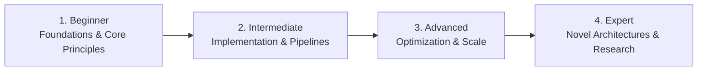

# 📂 Programming Languages & Systems Coding

> **Category Directory**: `categories/02-programming-languages/`  
> **Status**: Comprehensive Universal Reference & Taxonomy Layer  
> **Mastery Progression**: Beginner → Intermediate → Advanced → Expert  

---

## Overview

Exhaustive coverage of software development languages: Systems, General-Purpose, Scripting, Functional, Data, Embedded, and Emerging Languages.

---

## 📑 Core Taxonomy & Skill Hierarchy

### 🔹 Systems Programming
- **C (C99, C11, C23, Pointers, Memory Management)**
- **C++ (Modern C++17/20/23, RAII, Templates, Concurrency)**
- **Rust (Borrow Checker, Lifetimes, Cargo, Tokio, Concurrency)**
- **Zig (Comptime, Manual Allocators, C Interop)**
- **D Language**
- **Nim**
- **Assembly (x86-64, ARM64, RISC-V, MIPS)**

### 🔹 General-Purpose Languages
- **Python (Asyncio, Type Hints, Metaclasses, C Extensions)**
- **Java (Modern Java 21 LTS, Virtual Threads, JVM Internals)**
- **C# (.NET 8/9, Async/Await, LINQ, Garbage Collection)**
- **Go / Golang (Goroutines, Channels, Interfaces, Tooling)**
- **Kotlin (Coroutines, Multiplatform, Android Interop)**
- **Swift (ARC, Protocols, Swift Concurrency)**
- **Scala (Akka, Functional & OOP)**
- **Ruby**
- **PHP (PHP 8.3+, JIT, Attributes)**
- **Dart**
- **Julia (High-Performance Scientific Computing)**
- **Crystal**
- **V (Vlang)**

### 🔹 Scripting Languages
- **JavaScript (ES2024+, V8 Engine, Event Loop)**
- **TypeScript (Advanced Type System, Generics, AST)**
- **Lua**
- **Bash / POSIX Shell Scripting**
- **PowerShell (Cmdlets, Objects, Pipeline)**
- **AWK & Sed (Stream Processing)**
- **Tcl**
- **Groovy**

### 🔹 Functional Programming
- **Haskell (Monads, Type Classes, Laziness)**
- **Erlang (BEAM VM, Actor Model, Fault Tolerance)**
- **Elixir (OTP, Mix, Concurrency)**
- **Clojure (Lisp on JVM, Immutability)**
- **F#**
- **OCaml**
- **Scheme & Racket**
- **Common Lisp**
- **Elm**

### 🔹 Data & Mathematical Languages
- **R (Tidyverse, ggplot2, Bioconductor)**
- **SQL (ANSI SQL, Dialects: Postgres, MySQL, Oracle, SQLite)**
- **MATLAB**
- **SAS**
- **SPSS Syntax**
- **Stata**

### 🔹 Low-Level & Hardware Languages
- **VHDL**
- **Verilog & SystemVerilog**
- **Embedded C / Arduino**
- **MicroPython & CircuitPython**
- **Forth**

### 🔹 Domain-Specific & Shading Languages
- **Solidity & Move (Smart Contracts)**
- **GLSL, HLSL, WGSL (GPU Shaders)**
- **LaTeX (Document Typesetting)**
- **Wolfram Language (Mathematica)**
- **Prolog (Logic Programming)**
- **COBOL & Fortran (Legacy & Scientific)**
- **Ada (High-Integrity Systems)**
- **APL / J / K / Q (Array Programming)**

### 🔹 Emerging & Next-Gen Languages
- **Mojo (AI Programming)**
- **Carbon (C++ Successor)**
- **Gleam (Type-Safe on BEAM)**
- **Roc**
- **Unison**
- **Vale**

---

## 🛠️ Essential Tools & Technologies

`GCC`, `Clang`, `Rustc/Cargo`, `CPython/PyPy`, `OpenJDK`, `Go Compiler`, `Node.js`, `LLVM`, `GDB`, `Valgrind`

---

## 🧭 Standard Learning Path

1. **Beginner**: Conceptual foundations, terminology, baseline environments, and foundational syntax.
2. **Intermediate**: Practical end-to-end implementations, component architecture, testing, and debugging.
3. **Advanced**: Performance profiling, distributed scaling, fault tolerance, and security hardening.
4. **Expert**: Architecture design, novel algorithmic research, and system-level innovation.

---

## 🚀 Practice Projects

### 🥉 Beginner Project
- Implement a basic working demonstration applying core principles with zero external dependencies.

### 🥈 Intermediate Project
- Build a production-ready application incorporating automated testing, API integration, and structured telemetry.

### 🥇 Advanced Project
- Design and deploy a fault-tolerant, scalable, distributed system with comprehensive CI/CD, observability, and evaluation.

---

## 🔗 Key Reference Repositories

- [https://github.com/EbookFoundation/free-programming-books](https://github.com/EbookFoundation/free-programming-books)
- [https://github.com/codecrafters-io/build-your-own-x](https://github.com/codecrafters-io/build-your-own-x)
- [https://github.com/TheAlgorithms](https://github.com/TheAlgorithms)
