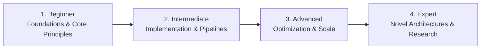

# 📂 Web Development (Full Stack Architecture)

> **Category Directory**: `categories/03-web-development/`  
> **Status**: Comprehensive Universal Reference & Taxonomy Layer  
> **Mastery Progression**: Beginner → Intermediate → Advanced → Expert  

---

## Overview

End-to-end web engineering: Modern Frontend, CSS Systems, State Management, Build Tools, Server Frameworks, APIs, Auth, and CMS.

---

## 📑 Core Taxonomy & Skill Hierarchy

### 🔹 Frontend Architecture
- **HTML5 Semantic Structure & Web APIs**
- **CSS3 Modern Layouts (Grid, Flexbox, Subgrid, Container Queries)**
- **JavaScript ESNext & Browser DOM Runtime**
- **TypeScript Strict Typing in Web Applications**
- **React 19 (Server Components, Actions, Suspense)**
- **Next.js (App Router, Server Actions, ISR, Turbopack)**
- **Vue 3 & Nuxt 3**
- **Angular 18+ (Signals, Standalone Components)**
- **Svelte 5 (Runes) & SvelteKit**
- **Solid.js & Qwik (Resumability)**
- **Astro & Islands Architecture**
- **Remix & Htmx**

### 🔹 CSS Frameworks & Design Systems
- **Tailwind CSS v3 & v4 Engine**
- **Shadcn UI & Radix Primitives**
- **Material UI & Joy UI**
- **Chakra UI & Mantine**
- **CSS-in-JS (Styled Components, Emotion)**
- **CSS Modules & Vanilla Extract**

### 🔹 Frontend State Management & Build Tools
- **Zustand, Jotai, Valtio, Redux Toolkit**
- **TanStack Query (React Query) & SWR**
- **XState (Statecharts)**
- **Vite, Rollup, esbuild, Webpack 5, SWC, Turbopack**

### 🔹 Backend Framework Ecosystems
- **Node.js (Express, Fastify, NestJS, Hono)**
- **Python (FastAPI, Django REST Framework, Flask)**
- **Java (Spring Boot 3, Quarkus)**
- **Go (Gin, Fiber, Chi, net/http)**
- **Rust (Actix-Web, Axum)**
- **PHP (Laravel 11, Symfony)**
- **Ruby on Rails 7+**
- **C# (ASP.NET Core Minimal APIs)**
- **Elixir (Phoenix, LiveView)**

### 🔹 API Architecture & Protocols
- **RESTful API Best Practices & HATEOAS**
- **GraphQL (Apollo, GraphQL Yoga, Schema Stitching)**
- **gRPC & Protocol Buffers**
- **WebSockets & Server-Sent Events (SSE)**
- **OpenAPI 3.1 & Swagger Tooling**
- **API Rate Limiting, Throttling & Caching**

### 🔹 Authentication, Authorization & Security
- **OAuth 2.1 & OpenID Connect (OIDC)**
- **JWT Security & Session Architecture**
- **Passkeys & WebAuthn (Passwordless)**
- **RBAC, ABAC & ReBAC Systems**
- **Auth Providers (Supabase Auth, Auth0, Clerk, Keycloak)**

---

## 🛠️ Essential Tools & Technologies

`Vite`, `Next.js`, `React`, `TypeScript`, `Tailwind CSS`, `FastAPI`, `NestJS`, `Postman`, `Playwright`, `Docker`

---

## 🧭 Standard Learning Path

1. **Beginner**: Conceptual foundations, terminology, baseline environments, and foundational syntax.
2. **Intermediate**: Practical end-to-end implementations, component architecture, testing, and debugging.
3. **Advanced**: Performance profiling, distributed scaling, fault tolerance, and security hardening.
4. **Expert**: Architecture design, novel algorithmic research, and system-level innovation.

---

## 🚀 Practice Projects

### 🥉 Beginner Project
- Implement a basic working demonstration applying core principles with zero external dependencies.

### 🥈 Intermediate Project
- Build a production-ready application incorporating automated testing, API integration, and structured telemetry.

### 🥇 Advanced Project
- Design and deploy a fault-tolerant, scalable, distributed system with comprehensive CI/CD, observability, and evaluation.

---

## 🔗 Key Reference Repositories

- [https://github.com/kamranahmedse/developer-roadmap](https://github.com/kamranahmedse/developer-roadmap)
- [https://github.com/sindresorhus/awesome-nodejs](https://github.com/sindresorhus/awesome-nodejs)
- [https://github.com/enaqx/awesome-react](https://github.com/enaqx/awesome-react)
- [https://github.com/dexteryy/spellbook-of-modern-webdev](https://github.com/dexteryy/spellbook-of-modern-webdev)
