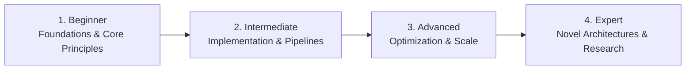

# 📂 Mobile Application Development

> **Category Directory**: `categories/04-mobile-development/`  
> **Status**: Comprehensive Universal Reference & Taxonomy Layer  
> **Mastery Progression**: Beginner → Intermediate → Advanced → Expert  

---

## Overview

Native and cross-platform mobile engineering for iOS, Android, and distributed mobile ecosystems.

---

## 📑 Core Taxonomy & Skill Hierarchy

### 🔹 Cross-Platform Frameworks
- **React Native & Expo (Architecture, Native Modules)**
- **Flutter (Dart, Riverpod, BLoC, Skia/Impeller)**
- **.NET MAUI (Modern C# Multi-platform)**
- **Kotlin Multiplatform (KMP/KMM)**
- **Ionic & Capacitor**
- **Tauri Mobile**

### 🔹 Native Android Development
- **Kotlin for Android**
- **Jetpack Compose (Declarative UI)**
- **Android Architecture Components & ViewModel**
- **Room Database & Coroutines/Flow**
- **Hilt & Dagger Dependency Injection**
- **Retrofit, OkHttp & Network Caching**
- **Android NDK (Native C/C++)**
- **Gradle Build Optimization**

### 🔹 Native iOS Development
- **Swift 6 (Strict Concurrency)**
- **SwiftUI & State Management**
- **UIKit Interoperability**
- **Combine Framework & Async/Await**
- **SwiftData & Core Data**
- **Core ML & Vision Integration**
- **WidgetKit, ARKit & App Clips**
- **Xcode Instruments & Memory Profiling**

### 🔹 Mobile Testing & DevOps
- **XCTest & XCUITest (iOS)**
- **Espresso & UI Automator (Android)**
- **Detox & Maestro (Cross-Platform E2E)**
- **Fastlane CI/CD Automation**
- **App Store & Google Play Publishing**
- **CodePush & Over-The-Air (OTA) Updates**
- **Crashlytics & Mobile Telemetry**

---

## 🛠️ Essential Tools & Technologies

`Xcode`, `Android Studio`, `Flutter`, `React Native`, `Expo`, `Fastlane`, `Maestro`, `Firebase`

---

## 🧭 Standard Learning Path

1. **Beginner**: Conceptual foundations, terminology, baseline environments, and foundational syntax.
2. **Intermediate**: Practical end-to-end implementations, component architecture, testing, and debugging.
3. **Advanced**: Performance profiling, distributed scaling, fault tolerance, and security hardening.
4. **Expert**: Architecture design, novel algorithmic research, and system-level innovation.

---

## 🚀 Practice Projects

### 🥉 Beginner Project
- Implement a basic working demonstration applying core principles with zero external dependencies.

### 🥈 Intermediate Project
- Build a production-ready application incorporating automated testing, API integration, and structured telemetry.

### 🥇 Advanced Project
- Design and deploy a fault-tolerant, scalable, distributed system with comprehensive CI/CD, observability, and evaluation.

---

## 🔗 Key Reference Repositories

- [https://github.com/jondot/awesome-react-native](https://github.com/jondot/awesome-react-native)
- [https://github.com/Solido/awesome-flutter](https://github.com/Solido/awesome-flutter)
