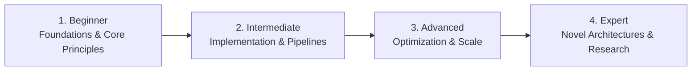

# 📂 DevOps, Cloud & Infrastructure Engineering

> **Category Directory**: `categories/05-devops-and-infrastructure/`  
> **Status**: Comprehensive Universal Reference & Taxonomy Layer  
> **Mastery Progression**: Beginner → Intermediate → Advanced → Expert  

---

## Overview

Containerization, Orchestration, Infrastructure as Code, Multi-Cloud architectures, Observability, and Site Reliability Engineering.

---

## 📑 Core Taxonomy & Skill Hierarchy

### 🔹 Containerization & Standards
- **Docker (Multi-Stage Builds, Security, Compose)**
- **Podman, Buildah & Skopeo**
- **OCI Container Image Specifications**
- **Distroless Images & Minimal Containers**

### 🔹 Kubernetes & Cloud Native Orchestration
- **Kubernetes Core (Deployments, StatefulSets, Services, Ingress)**
- **Helm Charts & Kustomize Packaging**
- **Kubernetes Operators & Custom Resource Definitions (CRDs)**
- **K3s, K0s & Edge Kubernetes**
- **ArgoCD & Flux (GitOps)**
- **Istio & Linkerd (Service Mesh)**
- **KEDA (Event-Driven Autoscaling)**

### 🔹 CI/CD & Release Automation
- **GitHub Actions (Custom Actions, Workflows, Runners)**
- **GitLab CI/CD Pipelines**
- **Tekton & Argo Workflows**
- **Release Engineering & Semantic Release**

### 🔹 Infrastructure as Code (IaC)
- **Terraform & OpenTofu (Modules, State Management)**
- **Pulumi (TypeScript/Python IaC)**
- **Ansible (Playbooks, Automation)**
- **AWS CDK & CloudFormation**
- **Crossplane (Control Planes on K8s)**

### 🔹 Cloud Platforms (AWS, Azure, GCP)
- **AWS (EC2, ECS, EKS, Lambda, S3, RDS, DynamoDB, VPC, IAM)**
- **Azure (AKS, App Service, Cosmos DB, Azure Entra ID)**
- **GCP (GKE, Cloud Run, BigQuery, Pub/Sub, Spanner)**
- **Cloudflare (Workers, Pages, R2, KV)**
- **Serverless & Edge Platforms (Vercel, Supabase, Railway)**

### 🔹 Observability & SRE
- **Prometheus & Grafana (Metrics, Alerting)**
- **OpenTelemetry (Traces, Metrics, Logs)**
- **ELK Stack & Grafana Loki**
- **Sentry Error Tracking**
- **SLOs, SLIs, Error Budgets & Chaos Engineering**

---

## 🛠️ Essential Tools & Technologies

`Kubernetes`, `Docker`, `Terraform`, `GitHub Actions`, `ArgoCD`, `Helm`, `Prometheus`, `Grafana`, `AWS CLI`

---

## 🧭 Standard Learning Path

1. **Beginner**: Conceptual foundations, terminology, baseline environments, and foundational syntax.
2. **Intermediate**: Practical end-to-end implementations, component architecture, testing, and debugging.
3. **Advanced**: Performance profiling, distributed scaling, fault tolerance, and security hardening.
4. **Expert**: Architecture design, novel algorithmic research, and system-level innovation.

---

## 🚀 Practice Projects

### 🥉 Beginner Project
- Implement a basic working demonstration applying core principles with zero external dependencies.

### 🥈 Intermediate Project
- Build a production-ready application incorporating automated testing, API integration, and structured telemetry.

### 🥇 Advanced Project
- Design and deploy a fault-tolerant, scalable, distributed system with comprehensive CI/CD, observability, and evaluation.

---

## 🔗 Key Reference Repositories

- [https://github.com/bregman-arie/devops-exercises](https://github.com/bregman-arie/devops-exercises)
- [https://github.com/veggiemonk/awesome-docker](https://github.com/veggiemonk/awesome-docker)
- [https://github.com/ramitsurana/awesome-kubernetes](https://github.com/ramitsurana/awesome-kubernetes)
- [https://github.com/donnemartin/awesome-aws](https://github.com/donnemartin/awesome-aws)
