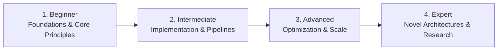

# 📂 Databases & Data Engineering

> **Category Directory**: `categories/06-databases-and-data-engineering/`  
> **Status**: Comprehensive Universal Reference & Taxonomy Layer  
> **Mastery Progression**: Beginner → Intermediate → Advanced → Expert  

---

## Overview

Relational, NoSQL, Graph, Vector, and Time-Series databases alongside modern Data Warehousing and Big Data streaming pipelines.

---

## 📑 Core Taxonomy & Skill Hierarchy

### 🔹 Relational Databases & SQL
- **PostgreSQL (JSONB, CTEs, Extensions, EXPLAIN ANALYZE)**
- **MySQL & MariaDB (InnoDB, Indexing, Replication)**
- **Distributed SQL (CockroachDB, TiDB, YugabyteDB)**
- **Connection Pooling (PgBouncer, ProxySQL)**

### 🔹 NoSQL & In-Memory Stores
- **MongoDB (Aggregation Pipeline, Sharding)**
- **Redis (Data Structures, Streams, Pub/Sub, Cluster)**
- **Apache Cassandra & ScyllaDB**
- **DynamoDB (Single Table Design)**

### 🔹 Vector Databases & Search Engines
- **pgvector (Postgres Vector Extension)**
- **Qdrant, Pinecone, Weaviate, Milvus**
- **Elasticsearch, OpenSearch & Meilisearch**

### 🔹 Streaming & Message Brokers
- **Apache Kafka (Kafka Connect, Streams, Schema Registry)**
- **RabbitMQ (Exchanges, Queues, Dead-Lettering)**
- **NATS & NATS JetStream**
- **Apache Pulsar**

### 🔹 Data Warehousing & Analytics
- **Snowflake & Databricks Lakehouse**
- **Google BigQuery & AWS Redshift**
- **ClickHouse & DuckDB (OLAP)**
- **Apache Spark (PySpark, Spark SQL)**
- **dbt (Data Build Tool)**
- **Apache Airflow & Dagster**

---

## 🛠️ Essential Tools & Technologies

`PostgreSQL`, `Redis`, `Kafka`, `ClickHouse`, `DuckDB`, `Spark`, `dbt`, `Airflow`, `Prisma`, `Drizzle`

---

## 🧭 Standard Learning Path

1. **Beginner**: Conceptual foundations, terminology, baseline environments, and foundational syntax.
2. **Intermediate**: Practical end-to-end implementations, component architecture, testing, and debugging.
3. **Advanced**: Performance profiling, distributed scaling, fault tolerance, and security hardening.
4. **Expert**: Architecture design, novel algorithmic research, and system-level innovation.

---

## 🚀 Practice Projects

### 🥉 Beginner Project
- Implement a basic working demonstration applying core principles with zero external dependencies.

### 🥈 Intermediate Project
- Build a production-ready application incorporating automated testing, API integration, and structured telemetry.

### 🥇 Advanced Project
- Design and deploy a fault-tolerant, scalable, distributed system with comprehensive CI/CD, observability, and evaluation.

---

## 🔗 Key Reference Repositories

- [https://github.com/pingcap/awesome-database-learning](https://github.com/pingcap/awesome-database-learning)
- [https://github.com/datastacktv/data-engineer-roadmap](https://github.com/datastacktv/data-engineer-roadmap)
