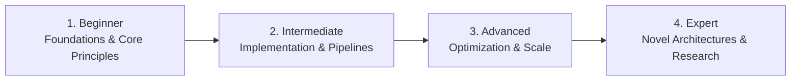

# 📂 Cybersecurity & Information Assurance

> **Category Directory**: `categories/07-cybersecurity/`  
> **Status**: Comprehensive Universal Reference & Taxonomy Layer  
> **Mastery Progression**: Beginner → Intermediate → Advanced → Expert  

---

## Overview

Offensive security, Red Teaming, Penetration Testing, Blue Teaming, Cryptography, DevSecOps, and Application Security.

---

## 📑 Core Taxonomy & Skill Hierarchy

### 🔹 Offensive Security & Pentesting
- **OWASP Top 10 Web Application Vulnerabilities**
- **Network Penetration Testing (Nmap, Wireshark)**
- **API & Cloud Security Testing**
- **Active Directory Attacks & Kerberos Exploitation**
- **Privilege Escalation (Linux & Windows)**
- **Burp Suite & Metasploit Framework**

### 🔹 Defensive Security & Blue Teaming
- **SIEM & Threat Hunting (Splunk, Elastic SIEM)**
- **EDR/XDR Systems & Falcon/SentinelOne**
- **Incident Response & Digital Forensics**
- **Malware Analysis (Static & Dynamic Sandboxing)**
- **Zero Trust Architecture**

### 🔹 DevSecOps & Software Supply Chain
- **Static Application Security Testing (SAST - Semgrep, CodeQL)**
- **Dynamic Application Security Testing (DAST)**
- **Software Bill of Materials (SBOM) & Dependency Auditing**
- **Secret Scanning (GitLeaks, TruffleHog)**

### 🔹 Applied Cryptography
- **Symmetric & Asymmetric Encryption (AES-GCM, RSA, Ed25519)**
- **Cryptographic Hashing (SHA-256, BLAKE3, Argon2)**
- **PKI, TLS/SSL Certificates & Key Management**
- **Post-Quantum Cryptography & Zero-Knowledge Proofs**

---

## 🛠️ Essential Tools & Technologies

`Burp Suite`, `Nmap`, `Wireshark`, `Metasploit`, `Semgrep`, `Ghidra`, `Vault`, `Snort`, `Zeek`

---

## 🧭 Standard Learning Path

1. **Beginner**: Conceptual foundations, terminology, baseline environments, and foundational syntax.
2. **Intermediate**: Practical end-to-end implementations, component architecture, testing, and debugging.
3. **Advanced**: Performance profiling, distributed scaling, fault tolerance, and security hardening.
4. **Expert**: Architecture design, novel algorithmic research, and system-level innovation.

---

## 🚀 Practice Projects

### 🥉 Beginner Project
- Implement a basic working demonstration applying core principles with zero external dependencies.

### 🥈 Intermediate Project
- Build a production-ready application incorporating automated testing, API integration, and structured telemetry.

### 🥇 Advanced Project
- Design and deploy a fault-tolerant, scalable, distributed system with comprehensive CI/CD, observability, and evaluation.

---

## 🔗 Key Reference Repositories

- [https://github.com/sbilly/awesome-security](https://github.com/sbilly/awesome-security)
- [https://github.com/enaqx/awesome-pentest](https://github.com/enaqx/awesome-pentest)
- [https://github.com/carpedm20/awesome-hacking](https://github.com/carpedm20/awesome-hacking)
- [https://github.com/trimstray/the-book-of-secret-knowledge](https://github.com/trimstray/the-book-of-secret-knowledge)
