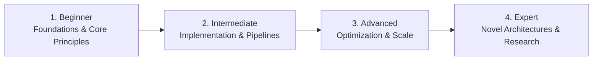

# 📂 Data Science & Advanced Analytics

> **Category Directory**: `categories/08-data-science-and-analytics/`  
> **Status**: Comprehensive Universal Reference & Taxonomy Layer  
> **Mastery Progression**: Beginner → Intermediate → Advanced → Expert  

---

## Overview

Exploratory data analysis, statistical modeling, hypothesis testing, data visualization, business intelligence, and scientific research.

---

## 📑 Core Taxonomy & Skill Hierarchy

### 🔹 Statistical Analysis & Inference
- **Descriptive & Inferential Statistics**
- **Hypothesis Testing (p-values, t-tests, ANOVA)**
- **Bayesian Statistics & MCMC**
- **A/B Testing & Causal Inference**

### 🔹 Data Processing & Wrangling
- **Pandas & Polars (High-Performance Dataframes)**
- **NumPy Vectorized Operations**
- **Feature Engineering & Imputation**
- **Data Cleaning & Anomaly Detection**

### 🔹 Data Visualization & BI
- **Matplotlib, Seaborn & Plotly**
- **D3.js Custom Visualizations**
- **Tableau, Power BI (DAX) & Apache Superset**
- **Data Storytelling & Executive Dashboards**

---

## 🛠️ Essential Tools & Technologies

`Python`, `Pandas`, `Polars`, `JupyterLab`, `Plotly`, `R`, `Tableau`, `Power BI`

---

## 🧭 Standard Learning Path

1. **Beginner**: Conceptual foundations, terminology, baseline environments, and foundational syntax.
2. **Intermediate**: Practical end-to-end implementations, component architecture, testing, and debugging.
3. **Advanced**: Performance profiling, distributed scaling, fault tolerance, and security hardening.
4. **Expert**: Architecture design, novel algorithmic research, and system-level innovation.

---

## 🚀 Practice Projects

### 🥉 Beginner Project
- Implement a basic working demonstration applying core principles with zero external dependencies.

### 🥈 Intermediate Project
- Build a production-ready application incorporating automated testing, API integration, and structured telemetry.

### 🥇 Advanced Project
- Design and deploy a fault-tolerant, scalable, distributed system with comprehensive CI/CD, observability, and evaluation.

---

## 🔗 Key Reference Repositories

- [https://github.com/academic/awesome-datascience](https://github.com/academic/awesome-datascience)
