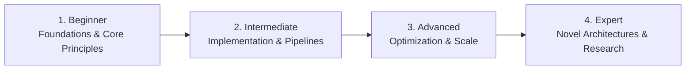

# 📂 Blockchain, Smart Contracts & Web3

> **Category Directory**: `categories/09-blockchain-and-web3/`  
> **Status**: Comprehensive Universal Reference & Taxonomy Layer  
> **Mastery Progression**: Beginner → Intermediate → Advanced → Expert  

---

## Overview

Decentralized ledgers, consensus protocols, EVM & SVM smart contracts, DeFi protocols, DAOs, and Zero-Knowledge proofs.

---

## 📑 Core Taxonomy & Skill Hierarchy

### 🔹 Blockchain Protocols & Consensus
- **Proof of Work, Proof of Stake, BFT**
- **EVM (Ethereum Virtual Machine) Architecture**
- **Solana Sealevel Runtime & Accounts Model**
- **Layer 2 Rollups (Optimistic, ZK-Rollups)**

### 🔹 Smart Contract Development
- **Solidity (Gas Optimization, Proxies, OpenZeppelin)**
- **Rust for Solana (Anchor Framework)**
- **Move (Aptos, Sui) & Cairo (StarkNet)**
- **Foundry & Hardhat Tooling**

### 🔹 DeFi, Security & Auditing
- **Automated Market Makers (AMMs) & Lending Pools**
- **Smart Contract Security & Reentrancy Mitigations**
- **Formal Verification & Slither Static Analysis**
- **Zero-Knowledge Proofs (zk-SNARKs, Circom)**

---

## 🛠️ Essential Tools & Technologies

`Foundry`, `Hardhat`, `Solidity`, `Anchor`, `Ethers.js`, `Viem`, `Slither`, `MetaMask`

---

## 🧭 Standard Learning Path

1. **Beginner**: Conceptual foundations, terminology, baseline environments, and foundational syntax.
2. **Intermediate**: Practical end-to-end implementations, component architecture, testing, and debugging.
3. **Advanced**: Performance profiling, distributed scaling, fault tolerance, and security hardening.
4. **Expert**: Architecture design, novel algorithmic research, and system-level innovation.

---

## 🚀 Practice Projects

### 🥉 Beginner Project
- Implement a basic working demonstration applying core principles with zero external dependencies.

### 🥈 Intermediate Project
- Build a production-ready application incorporating automated testing, API integration, and structured telemetry.

### 🥇 Advanced Project
- Design and deploy a fault-tolerant, scalable, distributed system with comprehensive CI/CD, observability, and evaluation.

---

## 🔗 Key Reference Repositories

- [https://github.com/OffcierCia/DeFi-Developer-Road-Map](https://github.com/OffcierCia/DeFi-Developer-Road-Map)
- [https://github.com/ConsenSys/smart-contract-best-practices](https://github.com/ConsenSys/smart-contract-best-practices)
- [https://github.com/bkrem/awesome-solidity](https://github.com/bkrem/awesome-solidity)
