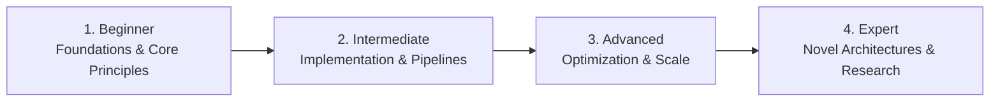

# 📂 Game Development & Interactive Graphics

> **Category Directory**: `categories/10-game-development/`  
> **Status**: Comprehensive Universal Reference & Taxonomy Layer  
> **Mastery Progression**: Beginner → Intermediate → Advanced → Expert  

---

## Overview

Game engines, real-time rendering, physics, shaders, gameplay systems, ECS architecture, and interactive XR experiences.

---

## 📑 Core Taxonomy & Skill Hierarchy

### 🔹 Game Engines & Frameworks
- **Unreal Engine 5 (C++, Blueprints, Nanite, Lumen)**
- **Unity (C#, Universal Render Pipeline, DOTS)**
- **Godot 4 (GDScript, C#, Vulkan Renderer)**
- **Bevy Engine (Rust ECS)**
- **Phaser & Web Game Engines**

### 🔹 Graphics Programming & Shaders
- **Vulkan, DirectX 12, Metal APIs**
- **Shader Programming (HLSL, GLSL, WGSL)**
- **Physically Based Rendering (PBR) & Ray Tracing**
- **Compute Shaders & GPU Optimization**

### 🔹 Gameplay Systems & Design
- **Entity Component System (ECS) Architecture**
- **Game AI (Behavior Trees, NavMesh, GOAP)**
- **Physics Engines (PhysX, Box2D, Rapier)**
- **Multiplayer Netcode & Rollback Synchronization**

---

## 🛠️ Essential Tools & Technologies

`Unreal Engine`, `Unity`, `Godot`, `Blender`, `RenderDoc`, `Vulkan SDK`, `FMOD`

---

## 🧭 Standard Learning Path

1. **Beginner**: Conceptual foundations, terminology, baseline environments, and foundational syntax.
2. **Intermediate**: Practical end-to-end implementations, component architecture, testing, and debugging.
3. **Advanced**: Performance profiling, distributed scaling, fault tolerance, and security hardening.
4. **Expert**: Architecture design, novel algorithmic research, and system-level innovation.

---

## 🚀 Practice Projects

### 🥉 Beginner Project
- Implement a basic working demonstration applying core principles with zero external dependencies.

### 🥈 Intermediate Project
- Build a production-ready application incorporating automated testing, API integration, and structured telemetry.

### 🥇 Advanced Project
- Design and deploy a fault-tolerant, scalable, distributed system with comprehensive CI/CD, observability, and evaluation.

---

## 🔗 Key Reference Repositories

- [https://github.com/lettier/3d-game-shaders-for-beginners](https://github.com/lettier/3d-game-shaders-for-beginners)
- [https://github.com/ellisonleao/magictools](https://github.com/ellisonleao/magictools)
- [https://github.com/Kavex/GameDev-Resources](https://github.com/Kavex/GameDev-Resources)
