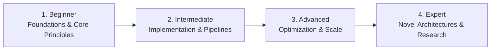

# 📂 Embedded Systems, IoT & Robotics

> **Category Directory**: `categories/11-embedded-systems-and-iot/`  
> **Status**: Comprehensive Universal Reference & Taxonomy Layer  
> **Mastery Progression**: Beginner → Intermediate → Advanced → Expert  

---

## Overview

Microcontrollers, RTOS, bare-metal C/C++, hardware protocols, PCB design, FPGA synthesis, and robotics platforms.

---

## 📑 Core Taxonomy & Skill Hierarchy

### 🔹 Microcontrollers & Bare-Metal
- **ARM Cortex-M (STM32, NXP)**
- **ESP32 & ESP8266 (WiFi/BLE)**
- **Raspberry Pi Pico & RP2040**
- **Bare-Metal C/C++ & Embedded Rust**
- **FreeRTOS & Zephyr RTOS**

### 🔹 Communication Protocols & IoT
- **UART, SPI, I2C, CAN Bus, Modbus**
- **MQTT, CoAP, LoRaWAN, BLE, Zigbee, Matter**
- **AWS IoT Core & ThingsBoard Platforms**

### 🔹 Hardware Design & Robotics
- **KiCad PCB Schematic & Layout Design**
- **FPGA Development (Verilog, VHDL)**
- **ROS 2 (Robot Operating System)**
- **Sensor Fusion, SLAM & Motion Control**

---

## 🛠️ Essential Tools & Technologies

`KiCad`, `STM32CubeIDE`, `PlatformIO`, `ROS 2`, `Logic Analyzers`, `Oscilloscopes`

---

## 🧭 Standard Learning Path

1. **Beginner**: Conceptual foundations, terminology, baseline environments, and foundational syntax.
2. **Intermediate**: Practical end-to-end implementations, component architecture, testing, and debugging.
3. **Advanced**: Performance profiling, distributed scaling, fault tolerance, and security hardening.
4. **Expert**: Architecture design, novel algorithmic research, and system-level innovation.

---

## 🚀 Practice Projects

### 🥉 Beginner Project
- Implement a basic working demonstration applying core principles with zero external dependencies.

### 🥈 Intermediate Project
- Build a production-ready application incorporating automated testing, API integration, and structured telemetry.

### 🥇 Advanced Project
- Design and deploy a fault-tolerant, scalable, distributed system with comprehensive CI/CD, observability, and evaluation.

---

## 🔗 Key Reference Repositories

- [https://github.com/nhivp/Awesome-Embedded](https://github.com/nhivp/Awesome-Embedded)
- [https://github.com/HQarroum/awesome-iot](https://github.com/HQarroum/awesome-iot)
