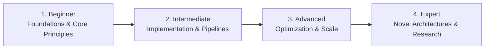

# 📂 Software Architecture & System Design

> **Category Directory**: `categories/12-software-architecture-and-design/`  
> **Status**: Comprehensive Universal Reference & Taxonomy Layer  
> **Mastery Progression**: Beginner → Intermediate → Advanced → Expert  

---

## Overview

Design patterns, architectural styles, distributed systems, high-scale system design, and architectural decision records (ADRs).

---

## 📑 Core Taxonomy & Skill Hierarchy

### 🔹 Design & Concurrency Patterns
- **Creational, Structural & Behavioral GoF Patterns**
- **Concurrency Patterns (Producer-Consumer, Actor, Reactor)**
- **SOLID, DRY, KISS & YAGNI Principles**

### 🔹 Architectural Styles
- **Clean Architecture & Hexagonal (Ports & Adapters)**
- **Domain-Driven Design (DDD - Aggregates, Bounded Contexts)**
- **Microservices vs Modular Monolith**
- **Event-Driven Architecture (EDA, CQRS, Event Sourcing)**

### 🔹 Distributed Systems & Scalability
- **CAP Theorem & PACELC Theorem**
- **Consensus Algorithms (Raft, Paxos)**
- **Distributed Caching, Sharding & Partitioning**
- **Circuit Breakers, Bulkheads & Idempotency**

---

## 🛠️ Essential Tools & Technologies

`Mermaid.js`, `PlantUML`, `C4 Model`, `Excalidraw`, `ADR Tools`

---

## 🧭 Standard Learning Path

1. **Beginner**: Conceptual foundations, terminology, baseline environments, and foundational syntax.
2. **Intermediate**: Practical end-to-end implementations, component architecture, testing, and debugging.
3. **Advanced**: Performance profiling, distributed scaling, fault tolerance, and security hardening.
4. **Expert**: Architecture design, novel algorithmic research, and system-level innovation.

---

## 🚀 Practice Projects

### 🥉 Beginner Project
- Implement a basic working demonstration applying core principles with zero external dependencies.

### 🥈 Intermediate Project
- Build a production-ready application incorporating automated testing, API integration, and structured telemetry.

### 🥇 Advanced Project
- Design and deploy a fault-tolerant, scalable, distributed system with comprehensive CI/CD, observability, and evaluation.

---

## 🔗 Key Reference Repositories

- [https://github.com/donnemartin/system-design-primer](https://github.com/donnemartin/system-design-primer)
- [https://github.com/ByteByteGoHq/system-design-101](https://github.com/ByteByteGoHq/system-design-101)
- [https://github.com/DovAmir/awesome-design-patterns](https://github.com/DovAmir/awesome-design-patterns)
- [https://github.com/simskij/awesome-software-architecture](https://github.com/simskij/awesome-software-architecture)
