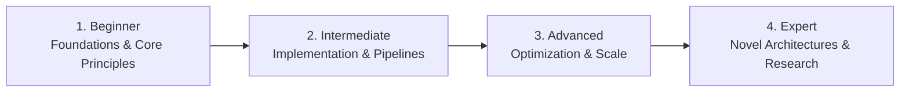

# 📂 Computer Science Fundamentals

> **Category Directory**: `categories/13-computer-science-fundamentals/`  
> **Status**: Comprehensive Universal Reference & Taxonomy Layer  
> **Mastery Progression**: Beginner → Intermediate → Advanced → Expert  

---

## Overview

Foundational data structures, algorithms, operating system internals, computer networking, compilers, and theoretical computer science.

---

## 📑 Core Taxonomy & Skill Hierarchy

### 🔹 Data Structures & Algorithms
- **Arrays, Linked Lists, Trees (AVL, Red-Black, B-Tree)**
- **Graphs, Disjoint Sets, Segment Trees, Bloom Filters**
- **Sorting, Searching, Graph Algorithms (Dijkstra, A*, BFS/DFS)**
- **Dynamic Programming & Complexity Analysis (Big-O)**

### 🔹 OS Internals & Networking
- **Process Scheduling, Threads, Memory Paging, Deadlocks**
- **OSI & TCP/IP Model, Socket Programming, QUIC Protocol**

### 🔹 Compilers & Theory of Computation
- **Lexical Analysis, AST Generation, LLVM IR, Optimization Passes**
- **Automata Theory, Formal Grammars, Turing Machines, P vs NP**

---

## 🛠️ Essential Tools & Technologies

`GDB`, `Valgrind`, `LLVM`, `Wireshark`, `Python`, `C++`

---

## 🧭 Standard Learning Path

1. **Beginner**: Conceptual foundations, terminology, baseline environments, and foundational syntax.
2. **Intermediate**: Practical end-to-end implementations, component architecture, testing, and debugging.
3. **Advanced**: Performance profiling, distributed scaling, fault tolerance, and security hardening.
4. **Expert**: Architecture design, novel algorithmic research, and system-level innovation.

---

## 🚀 Practice Projects

### 🥉 Beginner Project
- Implement a basic working demonstration applying core principles with zero external dependencies.

### 🥈 Intermediate Project
- Build a production-ready application incorporating automated testing, API integration, and structured telemetry.

### 🥇 Advanced Project
- Design and deploy a fault-tolerant, scalable, distributed system with comprehensive CI/CD, observability, and evaluation.

---

## 🔗 Key Reference Repositories

- [https://github.com/ossu/computer-science](https://github.com/ossu/computer-science)
- [https://github.com/jwasham/coding-interview-university](https://github.com/jwasham/coding-interview-university)
- [https://github.com/trekhleb/javascript-algorithms](https://github.com/trekhleb/javascript-algorithms)
