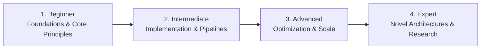

# 📂 Desktop Application Development

> **Category Directory**: `categories/14-desktop-application-development/`  
> **Status**: Comprehensive Universal Reference & Taxonomy Layer  
> **Mastery Progression**: Beginner → Intermediate → Advanced → Expert  

---

## Overview

Cross-platform and native desktop application frameworks: Electron, Tauri, Qt, WinUI, Avalonia, and macOS SwiftUI.

---

## 📑 Core Taxonomy & Skill Hierarchy

### 🔹 Web-Based Desktop Frameworks
- **Electron (Main/Renderer Process, IPC, Performance)**
- **Tauri (Rust Backend, Web Frontend, Lightweight Binaries)**

### 🔹 Native & Cross-Platform Desktop GUI
- **Qt 6 (C++, QML, Python PyQt/PySide)**
- **WinUI 3 & WPF (.NET)**
- **Avalonia UI (Cross-Platform XAML)**
- **macOS Native SwiftUI & AppKit**
- **Dear ImGui & Immediate Mode GUI**

---

## 🛠️ Essential Tools & Technologies

`Tauri`, `Electron`, `Qt Creator`, `Visual Studio`, `Xcode`

---

## 🧭 Standard Learning Path

1. **Beginner**: Conceptual foundations, terminology, baseline environments, and foundational syntax.
2. **Intermediate**: Practical end-to-end implementations, component architecture, testing, and debugging.
3. **Advanced**: Performance profiling, distributed scaling, fault tolerance, and security hardening.
4. **Expert**: Architecture design, novel algorithmic research, and system-level innovation.

---

## 🚀 Practice Projects

### 🥉 Beginner Project
- Implement a basic working demonstration applying core principles with zero external dependencies.

### 🥈 Intermediate Project
- Build a production-ready application incorporating automated testing, API integration, and structured telemetry.

### 🥇 Advanced Project
- Design and deploy a fault-tolerant, scalable, distributed system with comprehensive CI/CD, observability, and evaluation.

---

## 🔗 Key Reference Repositories

- [https://github.com/sindresorhus/awesome-electron](https://github.com/sindresorhus/awesome-electron)
