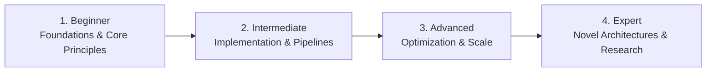

# 📂 Testing, Quality Assurance & Verification

> **Category Directory**: `categories/15-testing-and-quality-assurance/`  
> **Status**: Comprehensive Universal Reference & Taxonomy Layer  
> **Mastery Progression**: Beginner → Intermediate → Advanced → Expert  

---

## Overview

Unit testing, integration testing, end-to-end automation, performance load testing, mutation testing, and QA methodologies.

---

## 📑 Core Taxonomy & Skill Hierarchy

### 🔹 Testing Methodologies
- **Test-Driven Development (TDD) & BDD (Cucumber/Gherkin)**
- **Test Pyramid, Fixtures, Mocks, Spies & Stubs**
- **Mutation Testing & Property-Based Testing (Hypothesis)**

### 🔹 Automation Frameworks
- **Unit Testing (pytest, Jest, Vitest, JUnit, xUnit)**
- **E2E Testing (Playwright, Cypress, Selenium)**
- **Performance & Load Testing (k6, Locust, JMeter)**

---

## 🛠️ Essential Tools & Technologies

`Playwright`, `pytest`, `Vitest`, `k6`, `Cypress`, `JMeter`

---

## 🧭 Standard Learning Path

1. **Beginner**: Conceptual foundations, terminology, baseline environments, and foundational syntax.
2. **Intermediate**: Practical end-to-end implementations, component architecture, testing, and debugging.
3. **Advanced**: Performance profiling, distributed scaling, fault tolerance, and security hardening.
4. **Expert**: Architecture design, novel algorithmic research, and system-level innovation.

---

## 🚀 Practice Projects

### 🥉 Beginner Project
- Implement a basic working demonstration applying core principles with zero external dependencies.

### 🥈 Intermediate Project
- Build a production-ready application incorporating automated testing, API integration, and structured telemetry.

### 🥇 Advanced Project
- Design and deploy a fault-tolerant, scalable, distributed system with comprehensive CI/CD, observability, and evaluation.

---

## 🔗 Key Reference Repositories

- [https://github.com/TheJambo/awesome-testing](https://github.com/TheJambo/awesome-testing)
- [https://github.com/atinfo/awesome-test-automation](https://github.com/atinfo/awesome-test-automation)
