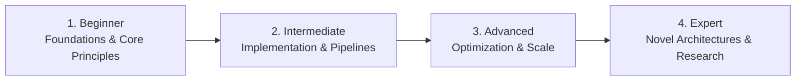

# 📂 Version Control, Git & Release Engineering

> **Category Directory**: `categories/16-version-control-and-collaboration/`  
> **Status**: Comprehensive Universal Reference & Taxonomy Layer  
> **Mastery Progression**: Beginner → Intermediate → Advanced → Expert  

---

## Overview

Advanced Git internals, branching strategies, monorepo management, semantic versioning, and collaborative workflows.

---

## 📑 Core Taxonomy & Skill Hierarchy

### 🔹 Advanced Git & Internals
- **Git Object Model (Blobs, Trees, Commits, Tags)**
- **Interactive Rebase, Reflog, Bisect, Cherry-Pick**
- **Git Worktrees, Submodules, Sparse Checkout**

### 🔹 Monorepo & Release Tooling
- **Monorepos (Turborepo, Nx, Bazel)**
- **Semantic Versioning & Conventional Commits**
- **Automated Changelog Generation**

---

## 🛠️ Essential Tools & Technologies

`Git`, `GitHub CLI`, `Turborepo`, `Nx`, `Commitlint`

---

## 🧭 Standard Learning Path

1. **Beginner**: Conceptual foundations, terminology, baseline environments, and foundational syntax.
2. **Intermediate**: Practical end-to-end implementations, component architecture, testing, and debugging.
3. **Advanced**: Performance profiling, distributed scaling, fault tolerance, and security hardening.
4. **Expert**: Architecture design, novel algorithmic research, and system-level innovation.

---

## 🚀 Practice Projects

### 🥉 Beginner Project
- Implement a basic working demonstration applying core principles with zero external dependencies.

### 🥈 Intermediate Project
- Build a production-ready application incorporating automated testing, API integration, and structured telemetry.

### 🥇 Advanced Project
- Design and deploy a fault-tolerant, scalable, distributed system with comprehensive CI/CD, observability, and evaluation.

---

## 🔗 Key Reference Repositories

- [https://github.com/git/git](https://github.com/git/git)
