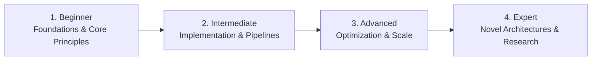

# 📂 Creative, UI/UX & Visual Design

> **Category Directory**: `categories/18-creative-and-design-skills/`  
> **Status**: Comprehensive Universal Reference & Taxonomy Layer  
> **Mastery Progression**: Beginner → Intermediate → Advanced → Expert  

---

## Overview

UI/UX design principles, design systems, Figma, typography, 3D modeling, audio production, and video editing.

---

## 📑 Core Taxonomy & Skill Hierarchy

### 🔹 UI/UX & Design Systems
- **Design Principles (Contrast, Hierarchy, Alignment)**
- **Design Systems (Tokens, Components, Patterns)**
- **Figma (Auto Layout, Variants, Variables, Dev Mode)**
- **Accessibility & Inclusive Design (WCAG 2.2)**

### 🔹 3D & Motion Design
- **3D Modeling & Texturing (Blender)**
- **Motion Graphics & Animation (After Effects)**
- **Audio Engineering & Sound Design (DAWs, Mixing)**

---

## 🛠️ Essential Tools & Technologies

`Figma`, `Blender`, `Adobe CC`, `Penpot`, `DaVinci Resolve`

---

## 🧭 Standard Learning Path

1. **Beginner**: Conceptual foundations, terminology, baseline environments, and foundational syntax.
2. **Intermediate**: Practical end-to-end implementations, component architecture, testing, and debugging.
3. **Advanced**: Performance profiling, distributed scaling, fault tolerance, and security hardening.
4. **Expert**: Architecture design, novel algorithmic research, and system-level innovation.

---

## 🚀 Practice Projects

### 🥉 Beginner Project
- Implement a basic working demonstration applying core principles with zero external dependencies.

### 🥈 Intermediate Project
- Build a production-ready application incorporating automated testing, API integration, and structured telemetry.

### 🥇 Advanced Project
- Design and deploy a fault-tolerant, scalable, distributed system with comprehensive CI/CD, observability, and evaluation.

---

## 🔗 Key Reference Repositories

- [https://github.com/alexpate/awesome-design-systems](https://github.com/alexpate/awesome-design-systems)
