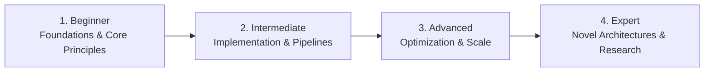

# 📂 Project Management & Product Methodologies

> **Category Directory**: `categories/19-project-management-and-methodologies/`  
> **Status**: Comprehensive Universal Reference & Taxonomy Layer  
> **Mastery Progression**: Beginner → Intermediate → Advanced → Expert  

---

## Overview

Agile methodologies, Scrum, Kanban, Product Management, DORA metrics, team topologies, and technical leadership.

---

## 📑 Core Taxonomy & Skill Hierarchy

### 🔹 Agile & Delivery Frameworks
- **Scrum & Kanban Workflows**
- **Shape Up Methodology**
- **DORA Metrics & Engineering Productivity**
- **Roadmapping & Prioritization (RICE, MoSCoW)**

### 🔹 Engineering Leadership
- **Technical Decision Making & RFC Processes**
- **Tech Debt Management & System Evolution**
- **1-on-1s, Mentorship & Team Topologies**

---

## 🛠️ Essential Tools & Technologies

`Linear`, `Jira`, `Notion`, `GitHub Projects`

---

## 🧭 Standard Learning Path

1. **Beginner**: Conceptual foundations, terminology, baseline environments, and foundational syntax.
2. **Intermediate**: Practical end-to-end implementations, component architecture, testing, and debugging.
3. **Advanced**: Performance profiling, distributed scaling, fault tolerance, and security hardening.
4. **Expert**: Architecture design, novel algorithmic research, and system-level innovation.

---

## 🚀 Practice Projects

### 🥉 Beginner Project
- Implement a basic working demonstration applying core principles with zero external dependencies.

### 🥈 Intermediate Project
- Build a production-ready application incorporating automated testing, API integration, and structured telemetry.

### 🥇 Advanced Project
- Design and deploy a fault-tolerant, scalable, distributed system with comprehensive CI/CD, observability, and evaluation.

---

## 🔗 Key Reference Repositories

- [https://github.com/kuchin/awesome-cto](https://github.com/kuchin/awesome-cto)
