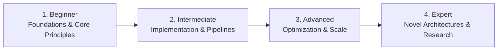

# 📂 Developer Tools & Developer Experience (DevEx)

> **Category Directory**: `categories/20-developer-tools-and-productivity/`  
> **Status**: Comprehensive Universal Reference & Taxonomy Layer  
> **Mastery Progression**: Beginner → Intermediate → Advanced → Expert  

---

## Overview

IDEs, terminal environments, shell utilities, package managers, AI coding assistants, and local development virtualization.

---

## 📑 Core Taxonomy & Skill Hierarchy

### 🔹 Terminal & Shell Environments
- **Zsh, Fish, Bash & Nushell**
- **Modern CLI Utilities (ripgrep, fd, fzf, jq, bat, eza)**
- **tmux & Terminal Multiplexers**
- **Dev Containers & Docker Development Environments**

### 🔹 AI Coding Workflows
- **Claude Code, Cursor, Codex CLI & GitHub Copilot**
- **Agent Context Management & Slash Command Workflows**
- **Prompt Engineering for Code Generation**

---

## 🛠️ Essential Tools & Technologies

`Neovim`, `VS Code`, `tmux`, `ripgrep`, `fzf`, `Docker`

---

## 🧭 Standard Learning Path

1. **Beginner**: Conceptual foundations, terminology, baseline environments, and foundational syntax.
2. **Intermediate**: Practical end-to-end implementations, component architecture, testing, and debugging.
3. **Advanced**: Performance profiling, distributed scaling, fault tolerance, and security hardening.
4. **Expert**: Architecture design, novel algorithmic research, and system-level innovation.

---

## 🚀 Practice Projects

### 🥉 Beginner Project
- Implement a basic working demonstration applying core principles with zero external dependencies.

### 🥈 Intermediate Project
- Build a production-ready application incorporating automated testing, API integration, and structured telemetry.

### 🥇 Advanced Project
- Design and deploy a fault-tolerant, scalable, distributed system with comprehensive CI/CD, observability, and evaluation.

---

## 🔗 Key Reference Repositories

- [https://github.com/alebcay/awesome-shell](https://github.com/alebcay/awesome-shell)
