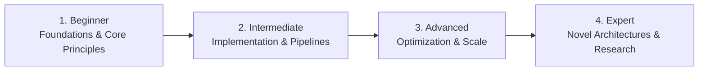

# 📂 Scientific Computing & Simulation

> **Category Directory**: `categories/22-scientific-computing-and-simulation/`  
> **Status**: Comprehensive Universal Reference & Taxonomy Layer  
> **Mastery Progression**: Beginner → Intermediate → Advanced → Expert  

---

## Overview

Numerical analysis, finite element methods, computational fluid dynamics, bioinformatics, geospatial analytics, and HPC.

---

## 📑 Core Taxonomy & Skill Hierarchy

### 🔹 Numerical Methods & Simulation
- **Numerical Integration, ODE/PDE Solvers**
- **Finite Element Analysis (FEA) & CFD**
- **Monte Carlo Methods & Molecular Dynamics**

### 🔹 Domain Scientific Computing
- **Bioinformatics & Genomic Sequences (BioPython)**
- **Geospatial Data (GeoPandas, PostGIS, QGIS)**
- **High-Performance Computing (MPI, OpenMP, CUDA)**

---

## 🛠️ Essential Tools & Technologies

`SciPy`, `NumPy`, `CUDA`, `OpenFOAM`, `QGIS`

---

## 🧭 Standard Learning Path

1. **Beginner**: Conceptual foundations, terminology, baseline environments, and foundational syntax.
2. **Intermediate**: Practical end-to-end implementations, component architecture, testing, and debugging.
3. **Advanced**: Performance profiling, distributed scaling, fault tolerance, and security hardening.
4. **Expert**: Architecture design, novel algorithmic research, and system-level innovation.

---

## 🚀 Practice Projects

### 🥉 Beginner Project
- Implement a basic working demonstration applying core principles with zero external dependencies.

### 🥈 Intermediate Project
- Build a production-ready application incorporating automated testing, API integration, and structured telemetry.

### 🥇 Advanced Project
- Design and deploy a fault-tolerant, scalable, distributed system with comprehensive CI/CD, observability, and evaluation.

---

## 🔗 Key Reference Repositories

- [https://github.com/rossant/awesome-math](https://github.com/rossant/awesome-math)
