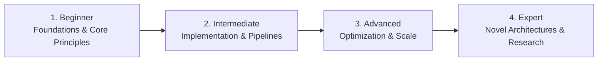

# 📂 Legal, Compliance & Open Source Governance

> **Category Directory**: `categories/23-legal-compliance-and-open-source/`  
> **Status**: Comprehensive Universal Reference & Taxonomy Layer  
> **Mastery Progression**: Beginner → Intermediate → Advanced → Expert  

---

## Overview

Open source licensing, software patents, GDPR/CCPA privacy compliance, accessibility mandates, and industry security standards.

---

## 📑 Core Taxonomy & Skill Hierarchy

### 🔹 Open Source Licensing & IP
- **Permissive vs Copyleft Licenses (MIT, Apache 2.0, GPLv3, AGPL)**
- **Contributor License Agreements (CLAs)**
- **Software Bill of Materials (SBOM) Compliance**

### 🔹 Regulatory & Privacy Standards
- **GDPR, CCPA & Privacy by Design**
- **Accessibility Standards (WCAG 2.2, Section 508)**
- **Industry Regulations (HIPAA, PCI-DSS, SOC 2, ISO 27001)**

---

## 🛠️ Essential Tools & Technologies

`FOSSA`, `Snyk`, `Lighthouse`, `Axe Core`

---

## 🧭 Standard Learning Path

1. **Beginner**: Conceptual foundations, terminology, baseline environments, and foundational syntax.
2. **Intermediate**: Practical end-to-end implementations, component architecture, testing, and debugging.
3. **Advanced**: Performance profiling, distributed scaling, fault tolerance, and security hardening.
4. **Expert**: Architecture design, novel algorithmic research, and system-level innovation.

---

## 🚀 Practice Projects

### 🥉 Beginner Project
- Implement a basic working demonstration applying core principles with zero external dependencies.

### 🥈 Intermediate Project
- Build a production-ready application incorporating automated testing, API integration, and structured telemetry.

### 🥇 Advanced Project
- Design and deploy a fault-tolerant, scalable, distributed system with comprehensive CI/CD, observability, and evaluation.

---

## 🔗 Key Reference Repositories

- [https://github.com/OpenSourceOrg/licenses](https://github.com/OpenSourceOrg/licenses)
