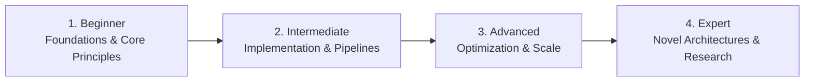

# 📂 Emerging Technologies & Frontiers

> **Category Directory**: `categories/24-emerging-technologies/`  
> **Status**: Comprehensive Universal Reference & Taxonomy Layer  
> **Mastery Progression**: Beginner → Intermediate → Advanced → Expert  

---

## Overview

Quantum computing, spatial computing (XR), brain-computer interfaces, edge computing, and autonomous robotics.

---

## 📑 Core Taxonomy & Skill Hierarchy

### 🔹 Quantum & Frontier Computing
- **Quantum Circuits & Algorithms (Qiskit, Cirq, Shor's, Grover's)**
- **Post-Quantum Cryptography & Error Correction**

### 🔹 Extended Reality & Edge Frontiers
- **WebXR, Spatial Computing & Vision Pro Development**
- **Edge AI & 5G Multi-Access Edge Computing (MEC)**
- **Autonomous Vehicle Systems & CARLA Simulation**

---

## 🛠️ Essential Tools & Technologies

`Qiskit`, `Cirq`, `WebXR`, `CARLA`, `Unity XR`

---

## 🧭 Standard Learning Path

1. **Beginner**: Conceptual foundations, terminology, baseline environments, and foundational syntax.
2. **Intermediate**: Practical end-to-end implementations, component architecture, testing, and debugging.
3. **Advanced**: Performance profiling, distributed scaling, fault tolerance, and security hardening.
4. **Expert**: Architecture design, novel algorithmic research, and system-level innovation.

---

## 🚀 Practice Projects

### 🥉 Beginner Project
- Implement a basic working demonstration applying core principles with zero external dependencies.

### 🥈 Intermediate Project
- Build a production-ready application incorporating automated testing, API integration, and structured telemetry.

### 🥇 Advanced Project
- Design and deploy a fault-tolerant, scalable, distributed system with comprehensive CI/CD, observability, and evaluation.

---

## 🔗 Key Reference Repositories

- [https://github.com/desireevl/awesome-quantum-computing](https://github.com/desireevl/awesome-quantum-computing)
