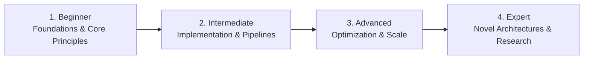

# 📂 Non-Technical, Real-World & Life Skills

> **Category Directory**: `categories/25-non-technical-and-real-world-skills/`  
> **Status**: Comprehensive Universal Reference & Taxonomy Layer  
> **Mastery Progression**: Beginner → Intermediate → Advanced → Expert  

---

## Overview

Personal finance, cognitive productivity, entrepreneurship, trades, survival skills, applied sciences, and lifelong learning.

---

## 📑 Core Taxonomy & Skill Hierarchy

### 🔹 Finance, Business & Marketing
- **Personal Finance, Budgeting & Investment Basics**
- **Entrepreneurship & Business Model Generation**
- **Digital Marketing (SEO, Content Strategy, Analytics)**

### 🔹 Cognitive Productivity & Health
- **Personal Knowledge Management (PKM - Zettelkasten, Second Brain)**
- **Deep Work, Time Blocking & Habit Formation**
- **Ergonomics, Physical Wellness & Stress Management**

### 🔹 Applied Arts, Trades & Practical Skills
- **Culinary Fundamentals & Nutrition**
- **Basic Electrical, Woodworking & Repair**
- **First Aid, CPR & Emergency Preparedness**

---

## 🛠️ Essential Tools & Technologies

`Obsidian`, `Notion`, `Spreadsheets`, `Anki`

---

## 🧭 Standard Learning Path

1. **Beginner**: Conceptual foundations, terminology, baseline environments, and foundational syntax.
2. **Intermediate**: Practical end-to-end implementations, component architecture, testing, and debugging.
3. **Advanced**: Performance profiling, distributed scaling, fault tolerance, and security hardening.
4. **Expert**: Architecture design, novel algorithmic research, and system-level innovation.

---

## 🚀 Practice Projects

### 🥉 Beginner Project
- Implement a basic working demonstration applying core principles with zero external dependencies.

### 🥈 Intermediate Project
- Build a production-ready application incorporating automated testing, API integration, and structured telemetry.

### 🥇 Advanced Project
- Design and deploy a fault-tolerant, scalable, distributed system with comprehensive CI/CD, observability, and evaluation.

---

## 🔗 Key Reference Repositories

- [https://github.com/sindresorhus/awesome](https://github.com/sindresorhus/awesome)
