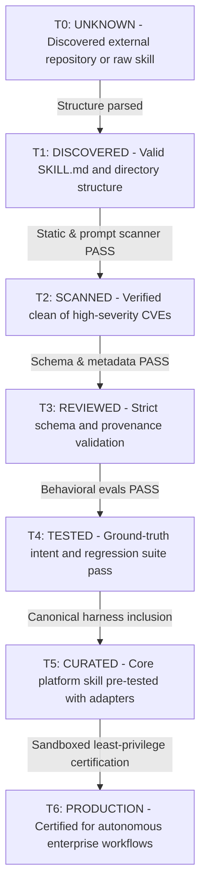

# All-Skills Multi-Dimensional Trust Model & T0–T6 Trust Ladder

**Effective Version:** 3.0.0  
**Effective Date:** 2026-09-21  
**Status:** Canonical & Enforced  

---

## 1. Overview & Separation of Dimensions

In the All-Skills architecture, the following terms represent **orthogonal dimensions** and must never be conflated:

| Dimension | Permitted Values | Meaning |
| :--- | :--- | :--- |
| **`availability`** | `catalog`, `active`, `archived` | Where the skill is accessible (entire catalog vs. pre-loaded in active harness). |
| **`review_status`** | `unreviewed`, `automated`, `human_reviewed` | Level of review conducted on documentation and code. |
| **`security_status`** | `unscanned`, `scanned_clean`, `warnings`, `quarantined` | Outcome of static AST and prompt-injection security inspections. |
| **`behavior_status`** | `unevaluated`, `eval_passed`, `eval_failed` | Behavioral eval results against ground-truth intent cases. |
| **`production_status`** | `experimental`, `candidate`, `approved` | Readiness for production deployment with irreversible actions. |
| **`trust_tier`** | `T0` to `T6` (see ladder below) | The progressive trust rank achieved by the skill. |

---

## 2. The T0–T6 Trust Ladder

A skill progresses upward through the trust ladder solely by satisfying objective, machine-verifiable verification gates. A skill is never promoted merely because it exists in the catalog.

### Trust Tier Definitions

1. **`T0_UNKNOWN` (Rank 0)**
   - Unverified raw skill or third-party repository clone.
   - Execution blocked in production; catalog inspection only.
2. **`T1_DISCOVERED` (Rank 1)**
   - Discovered in catalog; parsed into registry index.
3. **`T2_SCANNED` (Rank 2)**
   - Processed by `SecurityScanner`; 0 high-severity vulnerabilities; no unsafe dynamic imports or shell escapes.
4. **`T3_REVIEWED` (Rank 3)**
   - Validated against `schemas/skill.schema.json` and `schemas/skill_identity.schema.json`; provenance locked.
5. **`T4_TESTED` (Rank 4)**
   - Passes behavioral intent evaluations, out-of-distribution rejection tests, and input/output contracts.
6. **`T5_CURATED` (Rank 5)**
   - Included in the 122 canonical skills or 72 active harness skills; verified across all 11 agent adapters.
7. **`T6_PRODUCTION` (Rank 6)**
   - Fully hardened with explicit least-privilege permissions, SSRF protection, isolated secret brokering, and fail-visible audit logging.

---

## 3. Promotion & Quarantine Invariants

1. **Fail-Closed on Demotion**: Any skill that triggers a security warning or is revoked via `revocations.json` is immediately quarantined (`trust_status: quarantined`) and blocked from execution.
2. **Preservation**: Quarantined skills are never deleted from disk; their forensic evidence and git commit history are retained in `quarantine/`.
