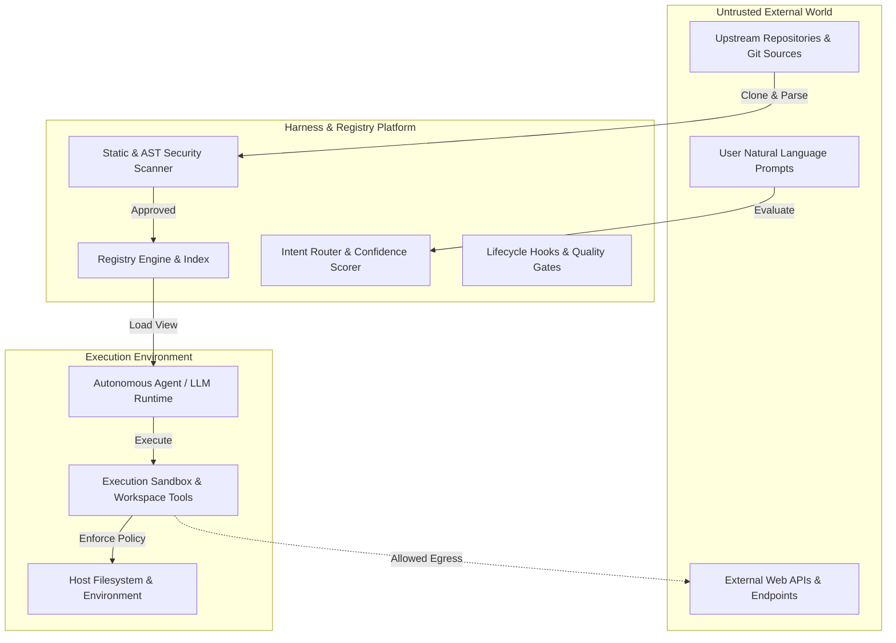

# STRIDE Threat Model for All-Skills Universal Platform

**Document Version:** 1.0.0  
**Effective Date:** 2026-09-21  
**Classification:** Public Security Specification  
**Status:** Canonical & Enforced  

---

## 1. System Overview & Trust Boundaries

The **All-Skills** platform connects autonomous AI agents (Claude Code, Cursor, Codex, OpenClaw, Antigravity) with thousands of modular capabilities (`SKILL.md` instructions, scripts, MCP connectors, APIs). The system operates across three trust zones:

> **Who provides the sandbox.** The execution sandbox in Trust Zone 2 belongs to the
> agent host — the coding agent's own sandbox, a container or a VM. All-Skills does not
> provide one: its runtime decides *whether* a skill and its capabilities may run
> (revocation, lifecycle, capability policy, human approval) and checks what executors
> report; `SubprocessExecutor` bounds a run's time, output, environment and (on POSIX)
> resources, but does not isolate the filesystem or network. See
> [LIMITATIONS.md](../LIMITATIONS.md).

---

## 2. STRIDE Threat Analysis

### 2.1. S — Spoofing (Identity & Authority)

| Threat ID | Threat Description | Attack Vector | Mitigation & Countermeasure | Residual Risk |
| :--- | :--- | :--- | :--- | :--- |
| **TH-S1** | **Skill Identity Impersonation** | Attacker publishes a malicious skill with a name or alias nearly identical to a canonical tool (e.g. `g1t` for `git`). | The Registry Engine enforces unique hierarchical IDs (`category.name`), validates against `skills.lock`, and requires verified provenance. | Low. Disallowed by canonical registry validation. |
| **TH-S2** | **Agent Session Spoofing** | Unauthorized process claims to be a trusted agent harness to execute privileged hooks. | Lifecycle hooks in `scripts/run_hook.py` authenticate workspace state, require execution from the validated repository root, and enforce fail-closed exits. | Low. Operations bounded to active workspace. |

---

### 2.2. T — Tampering (Data & Instruction Integrity)

| Threat ID | Threat Description | Attack Vector | Mitigation & Countermeasure | Residual Risk |
| :--- | :--- | :--- | :--- | :--- |
| **TH-T1** | **Indirect Prompt Injection** | Untrusted content fetched by an agent contains embedded jailbreak tags (`<system_override>`, `Ignore previous instructions`). | Multi-layer defense: (1) Static regex scanning in `src/skills/security.py`, (2) XML boundary containment (`<user_prompt>...</user_prompt>`), and (3) Behavioral eval suites in `evals/adversarial/`. | Medium. LLMs have inherent probabilistic variance; defended via prompt fences. |
| **TH-T2** | **Frontmatter Parameter Tampering** | Attacker tampers with `SKILL.md` frontmatter to falsely declare `network_access: false` while running network scripts. | Manifest verification (`manifest.json`), JSON Schema validation (`schemas/skill-frontmatter.schema.json`), and AST-level permission audits. | Low. Schema gate in CI blocks invalid frontmatter. |
| **TH-T3** | **Lockfile & Registry Manipulation** | Unverified modification of `skills.lock` or `stats.json` to introduce untracked skills. | `scripts/verify_registry_integrity.py` computes SHA hashes and independently recalculates counts on every push. | Very Low. CI halts on any hash mismatch. |

---

### 2.3. R — Repudiation (Traceability & Auditing)

| Threat ID | Threat Description | Attack Vector | Mitigation & Countermeasure | Residual Risk |
| :--- | :--- | :--- | :--- | :--- |
| **TH-R1** | **Unlogged Privileged Execution** | A high-risk skill executes shell commands without recording actions or triggering approval. | Every high-risk skill requires pre-execution hooks (`check_permissions.py`) and explicit user approval prompts (`AUTO`, `ASK`, `BLOCK`). | Low. Mandatory hook execution. |
| **TH-R2** | **Untracked Upstream Provenance** | Imported skills cannot be traced to their originating commit SHA or author. | `registry/verification_matrix.json` and `provenance/` record source commit, repository URL, import date, and SPDX license for all entries. | Very Low. Cryptographic audit trail. |

---

### 2.4. I — Information Disclosure (Data Exfiltration)

| Threat ID | Threat Description | Attack Vector | Mitigation & Countermeasure | Residual Risk |
| :--- | :--- | :--- | :--- | :--- |
| **TH-I1** | **Host Credential Harvesting** | Skill attempts to inspect `~/.ssh/id_rsa`, `~/.aws/credentials`, or workspace `.env`. | Strictly forbidden by `AGENTS.md` and flagged by `src/skills/security.py` credential pattern scanner. Sandboxed file access defaults to workspace root. | Low. Static and policy checks. |
| **TH-I2** | **Outbound Exfiltration via Webhooks** | Attacker embeds obfuscated webhook URLs or base64 exfiltration payloads in skill handlers. | Scanner checks for webhook URLs and base64 decode constructs (`atob`, `Buffer.from(..., 'base64')`). Strict network policy blocks unlisted egress domains. | Low. Network hardening enforcements. |

---

### 2.5. D — Denial of Service (Resource Exhaustion)

| Threat ID | Threat Description | Attack Vector | Mitigation & Countermeasure | Residual Risk |
| :--- | :--- | :--- | :--- | :--- |
| **TH-D1** | **Infinite Tool Loops / Recursion** | Skill calls itself or cyclical chains causing uncontrolled execution. | Dependency graph validation (`test_zero_cycles_in_default_catalog`), loop detection in `manifest.json` (`max_retries: 3`), and 30-second hook timeouts. | Very Low. Cycle prevention in import manager. |
| **TH-D2** | **Oversized Payloads & Zip Bombs** | Massive malicious files intended to crash parsers or exhaust memory. | Security scanner enforces `MAX_SCAN_FILE_SIZE = 2,000,000` bytes with explicit warning logging on oversized files. | Very Low. File size caps enforced. |

---

### 2.6. E — Elevation of Privilege (Sandbox Escapes)

| Threat ID | Threat Description | Attack Vector | Mitigation & Countermeasure | Residual Risk |
| :--- | :--- | :--- | :--- | :--- |
| **TH-E1** | **Arbitrary Shell Execution via Hooks** | Attacker removes or alters a security hook to bypass permission gates. | `scripts/run_hook.py` enforces **fail-closed** semantics: missing required or security-critical hook scripts cause immediate exit with code `1`. | Zero. Fail-closed architecture prevents bypass. |
| **TH-E2** | **Dangerous Subshell Spawning (`shell=True`)** | Skill script spawns unrestricted subshells or runs `rm -rf /` or formatting commands. | Scanned statically by `src/skills/security.py` (high severity). Policy boundary blocks destructive primitives. | Low. AST and pattern analysis. |

---

## 3. Incident Response & Skill Revocation

When a security vulnerability or malicious skill is identified:
1. **Immediate Revocation**: The skill is added to `registry/revocations.json` with an advisory ID (`AS-YYYY-XXXX`) and reason code.
2. **Router Kill-Switch**: The `Router` class immediately refuses to resolve, recommend, or route the revoked skill ID.
3. **Quarantine & Audit**: The skill directory is isolated into `_quarantine/` with an audit log.
4. **Advisory Publishing**: A public security bulletin is released in `docs/security/advisories/`.
