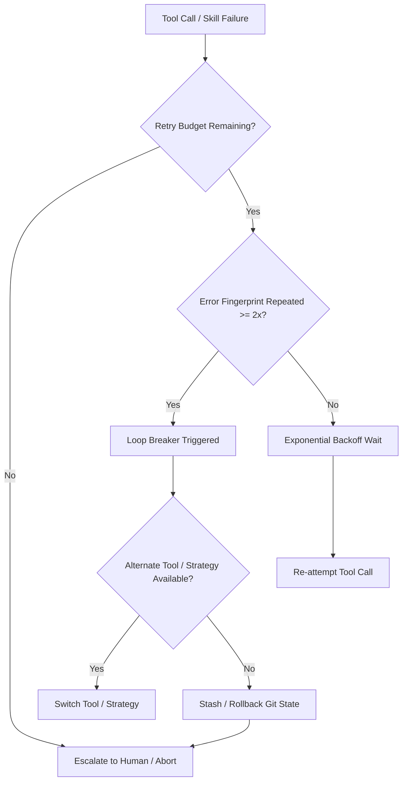

# Autonomous Agent Fallback & Recovery Specification

## 1. Overview

Autonomous agents executing tasks in dynamic software development environments face transient tool failures, syntax errors, permission boundaries, and external API timeouts. Unchecked retry logic frequently produces **infinite loops**, burning tokens and risking repository corruption.

This specification standardizes **deterministic fallback hierarchies**, **state fingerprinting**, and **rollback mechanisms**.

---

## 2. The 4-Tier Recovery Decision Tree



### Tier 1: Transient Error Retry (Exponential Backoff)
- **Scope**: Network blips, rate limits (HTTP 429), lock file contention, or temporary busy states.
- **Protocol**: 
  - Attempt 1: Wait 1s
  - Attempt 2: Wait 3s
  - Attempt 3: Wait 8s
  - Maximum retry budget: `3` (defined in `manifest.json`).

### Tier 2: Alternate Tool / Syntax Parser Fallback
- **Scope**: A specific tool format or command fails (e.g., regex replacement fails due to indentation mismatch, or ripgrep regex fails).
- **Protocol**:
  - If string replacement tool fails $\rightarrow$ fallback to AST-based replacement (`libcst`, `ast-grep`, or line-scoped whole-block replacement).
  - If package manager command fails (e.g. `pnpm`) $\rightarrow$ fallback to canonical `npm` or `pip`.
  - If headless browser navigation times out $\rightarrow$ fallback to raw HTTP extraction (`read_url_content`).

### Tier 3: Isolated Minimal Reproduction
- **Scope**: A large test or build command fails with an incomprehensible trace.
- **Protocol**:
  - The agent must isolate the failing unit test into a scratch file (`scratch/reproduce_issue.py`) rather than repeatedly running the entire test suite.
  - Reproduce root cause with zero side-effects.

### Tier 4: Safe Rollback & Human Escalation
- **Scope**: Irrecoverable syntax corruption, destructive failure, or exhausted retry budget.
- **Protocol**:
  - Execute `python scripts/run_hook.py failure <skill_id> --rollback`.
  - The hook queries `.agents/state/baseline_sha.txt` and resets workspace to the pre-execution snapshot.
  - Formulate an explicit, unambiguous escalation prompt to the user detailing:
    1. The exact tool call and arguments attempted.
    2. The exact error output received.
    3. The baseline commit SHA preserved.

---

## 3. State Fingerprinting & Infinite Loop Prevention

### The Problem
Agents often apologize and run the exact same failing command in a loop, hallucinating minor prompt changes while passing identical invalid arguments to tools.

### The Mechanism
1. The on-failure hook (`hooks/on_failure/handle_recovery.py`) computes a SHA-256 hash of the normalized error trace:
   $$\text{hash} = \text{SHA256}(\text{normalized\_error})[:12]$$
2. It records the failure sequence in `.agents/state/error_history.json`.
3. **Loop Breaker Threshold**: If **2 consecutive failures** share the same fingerprint for the same skill, the process exits immediately with exit code `2`, preventing runaway token expenditure.

---

## 4. Standard SKILL.md Frontmatter Integration

Every autonomous skill can define its recovery profile directly in its YAML frontmatter:

```yaml
---
name: database-migration
description: Execute database schema migrations safely with zero downtime.
recovery:
  fallback_skill: database-rollback
  max_retries: 2
  on_failure: rollback
---
```
