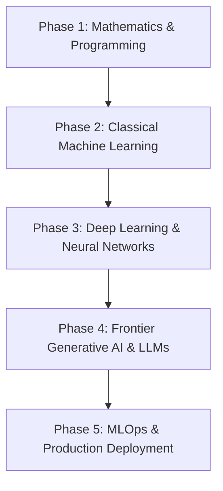

# 🤖 AI & Machine Learning Engineer Roadmap

A comprehensive guide from foundational mathematics to deploying frontier models at scale.

### Phase 1: Mathematics & Programming
- **Languages**: Python (NumPy, SciPy, Pandas), C++ for inference engines.
- **Linear Algebra**: Matrix multiplications, eigenvalues/eigenvectors, SVD.
- **Calculus & Optimization**: Gradients, partial derivatives, Stochastic Gradient Descent (SGD), Adam.
- **Probability & Statistics**: Distributions, Bayes Theorem, Hypothesis Testing.

### Phase 2: Classical Machine Learning
- **Supervised Learning**: Linear/Logistic Regression, Decision Trees, Random Forests, XGBoost, LightGBM.
- **Unsupervised Learning**: K-Means, DBSCAN, PCA, t-SNE.
- **Evaluation**: Precision, Recall, F1-Score, ROC-AUC, Cross-Validation.

### Phase 3: Deep Learning & Neural Networks
- **Core Frameworks**: PyTorch, JAX.
- **Architectures**: CNNs (Computer Vision), RNNs/LSTMs, Transformers (Self-Attention, Multi-Head Attention).
- **Techniques**: Batch Normalization, Dropout, Transfer Learning, Mixed-Precision Training (FP16/BF16).

### Phase 4: Frontier Generative AI & LLMs
- **LLM Fine-Tuning**: LoRA, QLoRA, SFT, DPO.
- **RAG Architecture**: Vector Embeddings, Hybrid Retrieval (BM25 + Dense), Rerankers (Cohere, BGE).
- **Agent Frameworks**: LangChain, LlamaIndex, AutoGPT, Tool Calling.
- **Vector DBs**: Qdrant, Pinecone, Milvus, pgvector.

### Phase 5: MLOps & Production Serving
- **Serving Engines**: vLLM, TGI, Triton Inference Server, ONNX Runtime.
- **Orchestration & Pipelines**: Kubeflow, Ray, Airflow.
- **Tracking & Registries**: MLflow, Weights & Biases.
