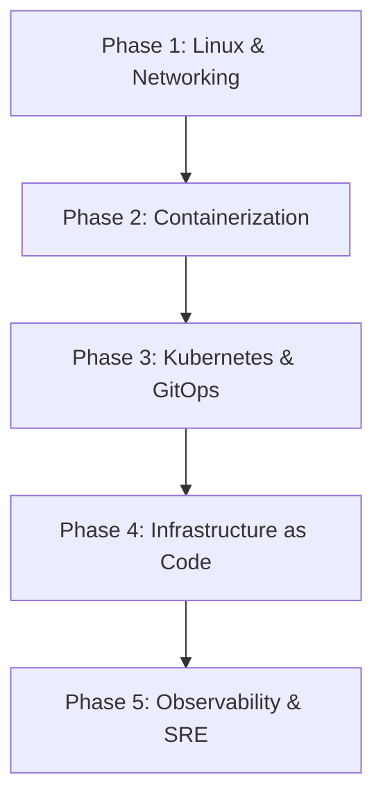

# ☁️ DevOps & Site Reliability Engineer Roadmap

Mastering infrastructure automation, container orchestration, and system reliability.

### Phase 1: Linux & Systems Administration
- **OS Internals**: Systemd, processes, file permissions, signals, kernel tuning (`sysctl`).
- **Networking**: TCP/IP, DNS, TLS/SSL, HTTP/2 & HTTP/3, firewalls (iptables/nftables).
- **Scripting**: Bash, Python, Go.

### Phase 2: Containerization
- **Engines**: Docker, Podman.
- **Best Practices**: Multi-stage builds, rootless containers, distroless images.

### Phase 3: Kubernetes & Cluster Management
- **Workloads**: Deployments, StatefulSets, DaemonSets, Jobs.
- **Networking**: Services, Ingress Controllers, CoreDNS, Calico / Cilium CNI.
- **Packaging & GitOps**: Helm, Kustomize, ArgoCD, Flux.

### Phase 4: Infrastructure as Code (IaC)
- **Provisioning**: Terraform, OpenTofu, Pulumi.
- **Configuration Management**: Ansible.
- **Cloud Providers**: AWS (IAM, VPC, EKS, RDS), GCP, Azure.

### Phase 5: Observability & Reliability
- **Telemetry**: Prometheus, Grafana, OpenTelemetry, Loki.
- **SRE Principles**: SLOs, SLIs, Error Budgets, Blameless Postmortems.
