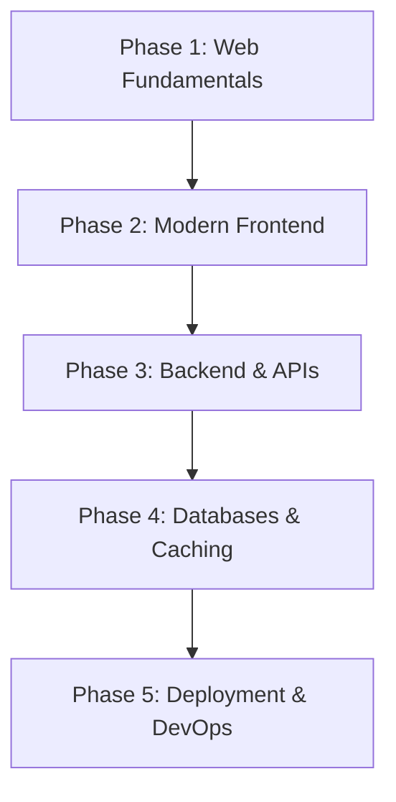

# 💻 Fullstack Software Engineer Roadmap

End-to-end guide to modern, resilient web application engineering.

### Phase 1: Web Fundamentals
- **Core Languages**: HTML5 Semantic Markup, CSS3 Layouts (Flexbox, Grid), JavaScript (ESNext, Event Loop).
- **Tooling**: Git, npm/pnpm, Chrome DevTools.

### Phase 2: Modern Frontend
- **Frameworks**: React 19, Next.js (App Router, Server Components), Vue 3 / Svelte.
- **Typing**: TypeScript (Strict mode, Generics, Utility Types).
- **Styling**: Tailwind CSS, CSS Modules, Shadcn UI / Radix Primitives.
- **State Management**: TanStack Query (Server state), Zustand (Client state).

### Phase 3: Backend & API Engineering
- **Runtimes & Frameworks**: Node.js (Fastify, NestJS), Python (FastAPI), Go (Gin, Fiber).
- **API Standards**: REST, GraphQL, gRPC, WebSockets.
- **Authentication**: OAuth 2.1, OIDC, JWT, Passkeys/WebAuthn, RBAC.

### Phase 4: Databases & Storage
- **Relational**: PostgreSQL, MySQL.
- **NoSQL & Cache**: Redis, MongoDB.
- **ORMs**: Prisma, Drizzle ORM, SQLAlchemy.

### Phase 5: Production Deployment
- **Containerization**: Docker, Docker Compose.
- **CI/CD**: GitHub Actions, automated test pipelines.
- **Hosting**: Cloudflare Pages/Workers, Vercel, AWS (ECS, S3, RDS).
