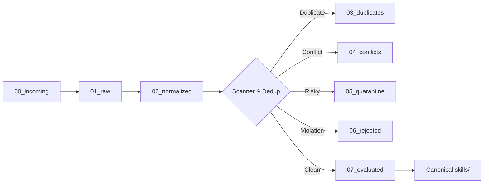

# 📥 Staging & Ingestion Pipeline (`scratch_priority_import/`)

> **Status**: Active Federated Staging Pipeline  
> **Rule**: Staging area for ingestion, normalization, and evaluation. Never execute untrusted third-party code directly.

---

## 🔄 7-Stage Ingestion Protocol

1. **`00_incoming/`**: Raw upstream repository clones or tarball downloads awaiting automated scanning.
2. **`01_raw/`**: Unprocessed skills identified by scanner across vendor, ecosystem, and community repos.
3. **`02_normalized/`**: Frontmatter and directory structure standardized to canonical `SKILL.md` format.
4. **`03_duplicates/`**: Flagged semantic and lexical duplicates (cosine similarity $> 0.90$).
5. **`04_conflicts/`**: Flagged dependency or capability conflicts awaiting resolution.
6. **`05_quarantine/`**: Skills containing high-risk capabilities or unverified system calls.
7. **`06_rejected/`**: Skills failing AST security audit, license policy, or malicious pattern detection.
8. **`07_evaluated/`**: Certified skills passing behavioral tests, ready for promotion to `skills/` or `awesome_skills/`.
